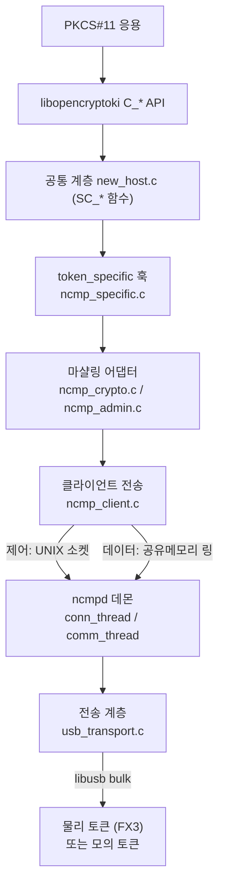
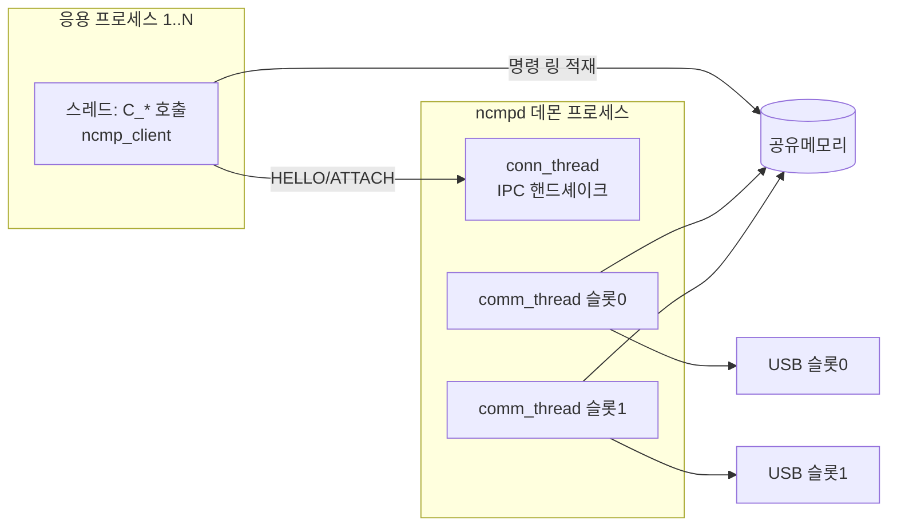
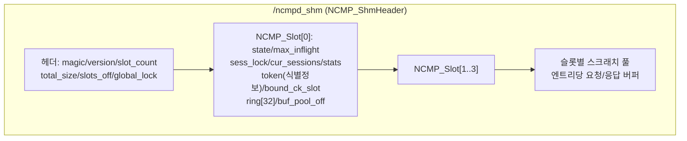
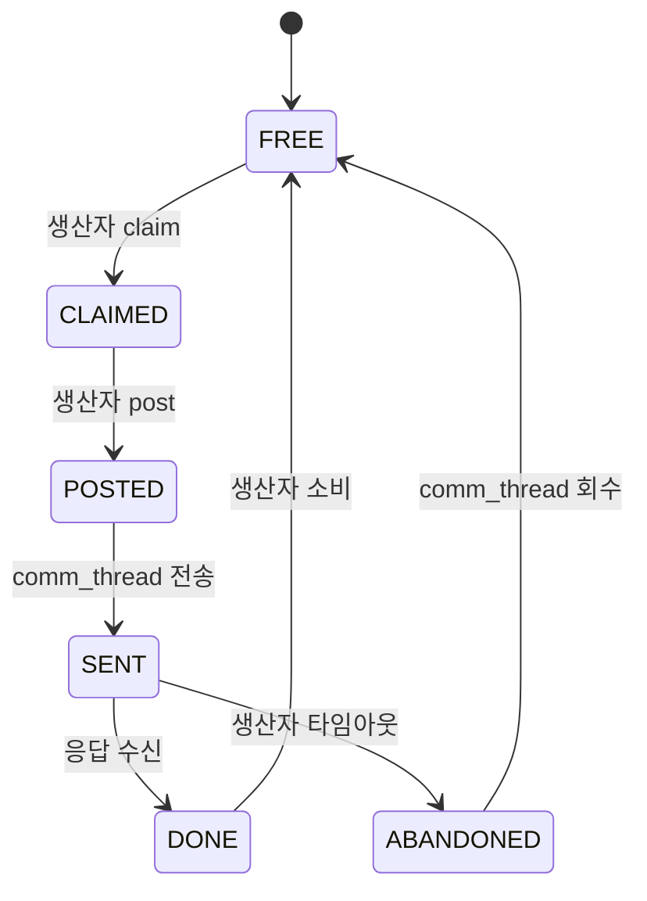
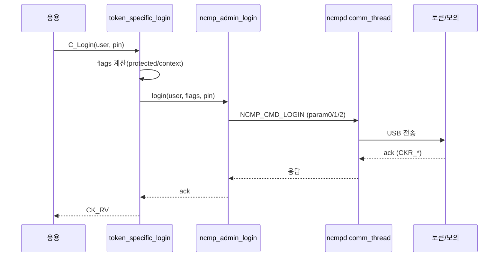
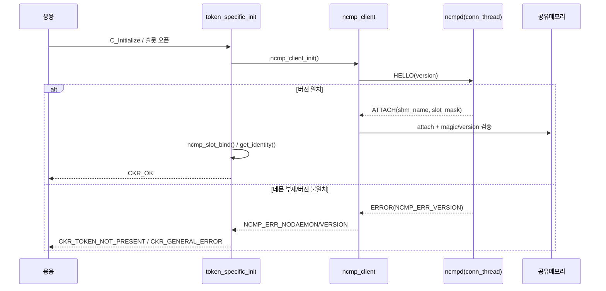
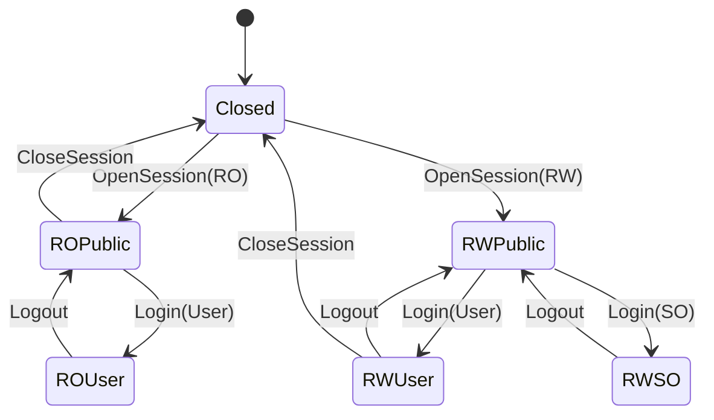
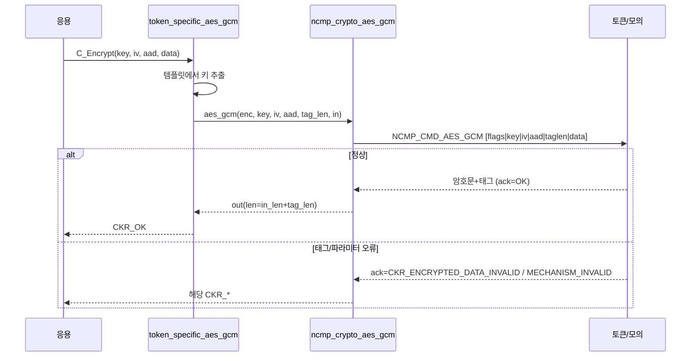
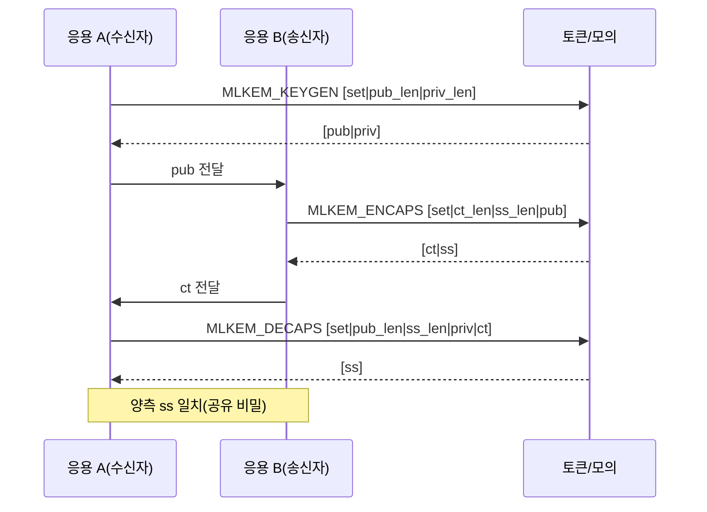
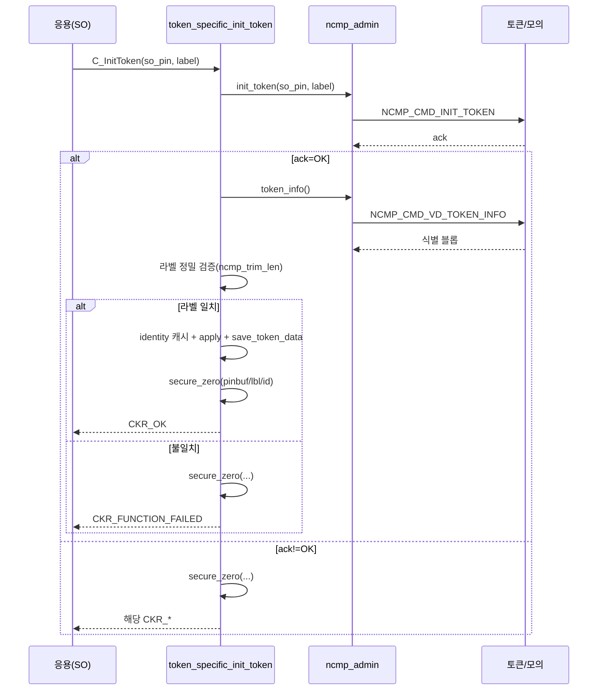

# NCMP 개발 상세서 (Software Design Description)

## 0. 문서 정보

| 항목 | 내용 |
|---|---|
| 문서명 | NCMP 개발 상세서 (NCMP Software Design Description) |
| 문서 버전 | v0.1 |
| 작성일 | 2026-09-04 |
| 작성자 | Hounjoung Rim |
| 검토자 | TBD (확인 필요: 검토 담당자 지정) |
| 보안등급 | TBD (확인 필요: 사내 보안등급 분류) |
| 관련 프로젝트/시스템명 | Token NCMP (openCryptoki 3.27.0 사설 포크 기반 PKCS#11 토큰) |
| 기준 코드 | openCryptoki 3.27.0 (`configure.ac:3`) 소스 트리 + `ncmp/`, `usr/lib/ncmp_stdll/` 추가 모듈 |

본 문서는 국내 암호모듈 검증(KCMVP) 대응 수준의 소프트웨어 설계 문서(SDD) 체계를 따른다. 기술된 모든 사양값·상수·구조체·함수는 실제 소스 코드에 정의된 위치를 함께 표기한다. NCMP로 신규 개발한 범위만 기술하며, openCryptoki 원본 기능은 연계 설명에 필요한 최소 범위에서만 언급한다.

---

## 목차

- 0. 문서 정보
- 1. 문서 개요
  - 1.1 목적
  - 1.2 범위
  - 1.3 대상 독자
  - 1.4 용어 및 약어 정의
  - 1.5 참조 문서
- 2. NCMP 개요
  - 2.1 NCMP의 정의와 역할
  - 2.2 도입 배경
  - 2.3 주요 기능 요약
  - 2.4 시스템 구성 요소 정의
- 3. 개발 환경
  - 3.1 운영체제 및 툴체인
  - 3.2 openCryptoki 버전 및 수정 범위
  - 3.3 의존 라이브러리
  - 3.4 빌드 산출물
  - 3.5 빌드 및 설치 절차
- 4. 전체 아키텍처
  - 4.1 계층 구조
  - 4.2 openCryptoki 내에서의 NCMP 배치
  - 4.3 프로세스 및 스레드 모델
  - 4.4 IPC 및 통신 구조
  - 4.5 메모리 및 공유자원 구조
  - 4.6 디렉터리 및 소스 트리 구성
- 5. 구성 요소 상세
  - 5.1 NCMP STDLL 라이브러리
  - 5.2 NCMP 데몬 (ncmpd)
  - 5.3 공통 모듈
- 6. CI (Command Interface) 명세
  - 6.1 CI 개요
  - 6.2 CI 목록표
  - 6.3 공통 메시지 포맷
  - 6.4 CI별 상세 명세
  - 6.5 처리 결과 코드
- 7. 주요 처리 흐름
- 8. NCMP 가정 사양 (Assumed Spec)
- 9. 부록

---

## 1. 문서 개요

본 장은 문서의 목적과 범위, 대상 독자, 용어, 참조 문서를 정의한다.

### 1.1 목적

본 문서는 openCryptoki 3.27.0 사설 포크에 신규 추가된 PKCS#11 토큰 **Token NCMP**의 소프트웨어 설계를 기술한다. 구성 요소의 구조, 명령 인터페이스(Command Interface, CI), 처리 흐름, 사양값을 실제 구현 코드에 근거하여 명세하는 것을 목적으로 한다. 본 문서는 사내 설계 검토와 대외 제출용 기술 근거 자료로 사용한다.

### 1.2 범위

본 문서의 기술 범위는 다음과 같다.

- NCMP STDLL(`libpkcs11_ncmp.so`)과 그 token_specific SPI 구현.
- NCMP 데몬(`ncmpd`)과 공유메모리·IPC·큐·전송 계층.
- NCMP 와이어 프로토콜 및 CI 명세.
- 소프트웨어 모의(mock) 토큰(하드웨어 데이터패스 에뮬레이터).

다음은 범위에서 제외한다.

- openCryptoki 원본 계층(`libopencryptoki`, `pkcsslotd`, `new_host.c` 등)의 내부 설계. NCMP 연계에 필요한 최소 범위만 인용한다.
- 물리 토큰(Cypress FX3 보드)의 펌웨어 내부 설계.
- 사용자 매뉴얼, 시험 결과 데이터, 마케팅성 서술.

### 1.3 대상 독자

- NCMP 토큰을 유지·보수하는 개발자.
- PKCS#11 응용을 NCMP 토큰에 연동하는 통합 담당자.
- 암호모듈 검증 및 보안 검토 담당자.

독자는 PKCS#11 표준과 C 언어, POSIX 스레드 및 공유메모리에 대한 기본 지식을 갖춘 것으로 가정한다.

### 1.4 용어 및 약어 정의

표 1-1은 본 문서에서 사용하는 용어와 약어를 정의한다.

표 1-1. 용어 및 약어

| 용어/약어 | 전체 명칭 | 정의 |
|---|---|---|
| NCMP | - | 본 프로젝트가 추가한 PKCS#11 토큰 및 그 통신 서브시스템의 명칭. |
| PKCS#11 | Public-Key Cryptography Standards #11 | 암호 토큰 접근을 위한 표준 API(Cryptoki). |
| STDLL | Standard Token Dynamic Link Library | openCryptoki에서 토큰별 동작을 구현하는 공유 라이브러리. NCMP의 산출물은 `libpkcs11_ncmp.so`. |
| CI | Command Interface | NCMP 와이어 프로토콜의 명령 인터페이스. `enum ncmp_opcode`로 정의된 오퍼레이션 집합. |
| SPI | Service Provider Interface | openCryptoki가 STDLL에 요구하는 `token_specific` 콜백 집합(`token_spec_t`). |
| 슬롯(Slot) | - | PKCS#11 논리 슬롯. NCMP는 CK 슬롯을 물리 토큰(물리 슬롯)에 바인딩한다. |
| 토큰(Token) | - | 슬롯에 삽입된 암호 장치. NCMP에서는 Cypress FX3 물리 보드 또는 모의 토큰. |
| 세션(Session) | - | 응용과 토큰 사이의 논리 연결. 슬롯당·시스템 전역 상한이 존재한다. |
| SHM | Shared Memory | POSIX 공유메모리. 대량 명령 데이터 전달 경로(`/ncmpd_shm`). |
| IPC | Inter-Process Communication | UNIX 도메인 소켓 기반 제어 채널(`/run/ncmpd/ncmpd.sock`). |
| MPSC | Multi-Producer Single-Consumer | 다수 생산자·단일 소비자 큐 모델. 슬롯 명령 링에 적용한다. |
| CAS | Compare-And-Swap | 원자적 비교-교환 연산. 큐 엔트리 상태 전이에 사용한다. |
| FX3 | Cypress EZ-USB FX3 | 물리 토큰으로 사용하는 USB 컨트롤러 보드(CYUSB3KIT-003). |
| XOF | eXtendable-Output Function | 가변 길이 출력 해시 함수. SHAKE-128/256. |
| PQC | Post-Quantum Cryptography | 양자내성 암호. 본 토큰은 ML-KEM, ML-DSA를 지원한다. |
| ML-KEM | Module-Lattice Key Encapsulation Mechanism | 격자 기반 키 캡슐화 메커니즘(FIPS 203). |
| ML-DSA | Module-Lattice Digital Signature Algorithm | 격자 기반 전자서명 알고리즘(FIPS 204). |

### 1.5 참조 문서

- PKCS#11 Cryptographic Token Interface Base Specification Version 2.40, 3.0, 3.2.
- openCryptoki 3.27.0 소스 트리 및 문서(`configure.ac:3`).
- 내부 설계 문서: `docs/architecture.md`, `docs/command-interface.md`, `docs/session-state-management.md`, `docs/stdll-call-flow.md`, `docs/INDEX.md`.
- 프로젝트 규칙: `CLAUDE.md`(자원 한계·동시성 규칙·광고 메커니즘 표면 정의).

---

## 2. NCMP 개요

본 장은 NCMP의 정의와 역할, 도입 배경, 주요 기능, 구성 요소를 개괄한다.

### 2.1 NCMP의 정의와 역할

NCMP는 openCryptoki 사설 포크에 추가된 PKCS#11 토큰과 그 통신 서브시스템이다. 물리 토큰은 libusb로 접근하는 Cypress EZ-USB FX3 보드(CYUSB3KIT-003)이다. NCMP STDLL(`libpkcs11_ncmp.so`)은 PKCS#11 응용의 암호 연산 요청을 수신하여, 독립 데몬 `ncmpd`를 통해 단일 USB 링크로 다중화(multiplexing)하여 물리 토큰에 전달한다. NCMP는 보안키 토큰(secure-key token)으로서 모든 키 데이터(Key Material)와 PIN 비밀정보를 물리 토큰이 보관하며, STDLL은 연산을 프록시(proxy)하고 임시 비밀정보를 소거하는 역할만 수행한다(`tok_struct.h:35`).

`ncmpd`는 `pkcsslotd`를 대체하거나 후킹하지 않는다. `ncmpd`는 다수 프로세스의 다수 클라이언트 스레드를 단일 USB 링크로 다중화하는 별도의 파이프/프록시 데몬이다.

### 2.2 도입 배경

기존 openCryptoki 토큰(ICA·CCA·EP11·soft)은 각 백엔드에 직접 연결한다. NCMP는 단일 USB 물리 링크를 다수 응용 프로세스가 동시에 공유해야 하는 요구를 충족하기 위해, 원격 백엔드 패턴(EP11/ICSF의 프록시 모델)을 채택한다. 하나의 데몬이 USB 링크와 공유메모리를 소유하고, 각 STDLL 프로세스는 공유메모리 큐에 명령을 적재하여 통신한다.

### 2.3 주요 기능 요약

- 대칭 암호: AES-GCM(AEAD), AES-CTR(스트림).
- 해시/XOF: SHA-256, SHA-512, SHA3-224/256/384/512, SHAKE-128/256 키 유도.
- 양자내성 암호: ML-KEM(강도 1/3/5), ML-DSA(강도 1/3/5).
- 난수 생성(RNG) 및 AES 키 생성.
- 토큰 관리: 로그인/로그아웃, PIN 초기화/변경, 토큰 초기화, UTC 시각 조회/설정, 토큰 파라미터 조회.
- 다중 프로세스·다중 세션 동시 접근(슬롯당 최대 8, 전역 최대 32).

광고 메커니즘 표면은 `ncmp_mech_list[]`(`ncmp_specific.c:99`)에 정의되며, 8.1절에 상세히 기술한다. RSA·EC/ECDSA·DH/ECDH·HMAC·AES 블록 모드(CBC/ECB/OFB/CFB)는 지원 대상이 아니며 코드·CI·모의·시험에서 제거되었다.

### 2.4 시스템 구성 요소 정의

표 2-1은 시스템 구성 요소를 한 줄로 정의한다.

표 2-1. 시스템 구성 요소

| 구성 요소 | 산출물 | 정의 |
|---|---|---|
| 모듈 A: 데몬 | `ncmpd` | 시스템 데몬. SHM과 USB 링크를 소유하고, 연결 스레드 1개와 슬롯당 통신 스레드를 운용한다. STDLL 적재 전에 실행되어야 한다. |
| 모듈 B: STDLL | `libpkcs11_ncmp.so` | openCryptoki 토큰 라이브러리. `token_specific` SPI를 구현하고 암호 연산을 CI로 마샬링한다. |
| 모듈 C: 모의 토큰 | `mock_token_ncmp` | FX3 데이터패스의 소프트웨어 에뮬레이터. `-DENABLE_MOCK_TOKEN=ON`으로 활성화한다. |
| 모듈 D: 시험 | `ncmp_tests` | API·동시성·한계·통계·강건 뮤텍스 복구·ACK 오류를 검증하는 C 시험 스위트. |
| 공통 기반 | `ncmp/common/` | 와이어·큐·SHM·뮤텍스·슬롯맵·IPC 원시 기능. |

## 3. 개발 환경

본 장은 개발·빌드 환경, 기준 openCryptoki 버전과 수정 범위, 의존 라이브러리, 빌드 산출물과 절차를 기술한다.

### 3.1 운영체제 및 툴체인

표 3-1은 개발·빌드 환경을 정리한다.

표 3-1. 개발 환경

| 항목 | 값 | 비고 |
|---|---|---|
| 운영체제/배포판 | Linux (Ubuntu 22.04 확인) | `Linux 6.8.0` 계열 커널에서 개발. |
| 언어 표준 | C11 | `CMAKE_C_STANDARD 11` (`ncmp/CMakeLists.txt:11`). |
| 컴파일러 | gcc 11.4.0 (Ubuntu 22.04) | GCC/C11 원자 연산 및 강건 뮤텍스 사용. |
| 독립 빌드 시스템 | CMake >= 3.16 | `cmake_minimum_required(VERSION 3.16)` (`ncmp/CMakeLists.txt:8`). |
| 통합 빌드 시스템 | GNU Autotools | openCryptoki 본체 빌드(`ncmp_stdll.mk`). |
| 전송 라이브러리 | libusb-1.0 | 실 하드웨어 빌드 시 필요. 모의 빌드에서는 불필요. |

컴파일 경고 정책은 신호로 사용하며, `-Wall -Wextra -Wshadow -Wpointer-arith -Wcast-qual`을 지정한다(`ncmp/CMakeLists.txt:15`). 강건·프로세스공유 뮤텍스는 glibc의 GNU/POSIX-2008 기능 집합을 요구하므로 `_GNU_SOURCE`를 정의한다(`ncmp/CMakeLists.txt:18`). 정적 라이브러리가 공유 STDLL에 링크되므로 모든 오브젝트를 위치 독립 코드(PIC)로 빌드한다(`ncmp/CMakeLists.txt:22`).

### 3.2 openCryptoki 버전 및 수정 범위

기준 코드는 openCryptoki 3.27.0이다(`AC_INIT([openCryptoki],[3.27.0]...)`, `configure.ac:3`). NCMP는 원본 계층을 수정하지 않고 다음을 신규 추가한다.

표 3-2. openCryptoki 대비 신규/수정 범위

| 구분 | 경로 | 성격 |
|---|---|---|
| STDLL 구현 | `usr/lib/ncmp_stdll/ncmp_specific.c` | 신규(token_specific SPI 구현, 1347행). |
| STDLL 식별/SPI 테이블 | `usr/lib/ncmp_stdll/tok_struct.h` | 신규(`token_spec_t token_specific`). |
| STDLL 빌드 조각 | `usr/lib/ncmp_stdll/ncmp_stdll.mk` | 신규(Autotools 링크 정의). |
| 슬롯맵 설정 샘플 | `usr/lib/ncmp_stdll/ncmptok.conf` | 신규(샘플). |
| NCMP 서브시스템 | `ncmp/` 전체 | 신규(데몬·공통·STDLL 어댑터·모의·시험). |

원본 공통 계층은 소스 링크로만 재사용한다(`ncmp_stdll.mk:24-48`: `new_host.c`, `sess_mgr.c`, `utility.c`, `loadsave.c`, `mech_*.c`, `pqc_supported.c` 등). 원본 파일 자체는 수정하지 않는다.

### 3.3 의존 라이브러리

표 3-3은 STDLL 링크 시 의존 라이브러리와 용도를 정리한다. 링크 플래그는 `ncmp_stdll.mk:19-21`에 정의된다.

표 3-3. 의존 라이브러리

| 라이브러리 | 링크 플래그 | 사용 목적 | 정의 위치 |
|---|---|---|---|
| libpthread | `-lpthread` | POSIX 스레드, 프로세스공유·강건 뮤텍스. | `ncmp_stdll.mk:20` |
| librt | `-lrt` | POSIX 공유메모리(`shm_open`) 및 타이머. | `ncmp_stdll.mk:20` |
| libcrypto (OpenSSL) | `-lcrypto` | openCryptoki 공통 계층의 소프트웨어 암호 연산. | `ncmp_stdll.mk:20` |
| libc | `-lc` | 표준 C 런타임. | `ncmp_stdll.mk:20` |
| liblber (OpenLDAP) | `-llber` | openCryptoki 공통 계층 의존. | `ncmp_stdll.mk:21` |
| libusb-1.0 | (데몬 빌드) | 실 FX3 토큰 USB 전송. 모의 빌드에서는 미사용. | `ncmp/cmake/FindLibUSB.cmake` |

심벌 가시성은 버전 스크립트 `opencryptoki_tok.map`으로 제한한다(`ncmp_stdll.mk:21`).

### 3.4 빌드 산출물

표 3-4는 빌드 산출물을 정리한다. 설치 경로·권한은 openCryptoki 통합 시 Autotools 규칙을 따르며, 미확정 항목은 TBD로 표기한다.

표 3-4. 빌드 산출물 목록

| 산출물 | 종류 | 설치 경로 | 권한/소유자 | 정의 위치 |
|---|---|---|---|---|
| `libpkcs11_ncmp.so` | 공유 라이브러리(STDLL) | `opencryptoki/stdll/` | TBD (확인 필요: 설치 규칙) | `ncmp_stdll.mk:1` |
| `ncmpd` | 실행 파일(데몬) | TBD (확인 필요: 설치 규칙) | root 권장(SHM/USB 소유) | `ncmp/daemon/CMakeLists.txt` |
| `ncmptok.conf` | 설정 파일 | `/etc/opencryptoki/ncmptok.conf` | TBD | `ncmptok.conf:9` |
| `mock_token_ncmp` | 실행 파일(모의) | (빌드 트리, 시험용) | - | `ncmp/mock/CMakeLists.txt` |
| `ncmp_tests` | 실행 파일(시험) | (빌드 트리, 시험용) | - | `ncmp/tests/CMakeLists.txt` |

STDLL 이름은 `-DSTDLL_NAME="ncmptok"`으로 지정한다(`ncmp_stdll.mk:10`). 토큰 데이터 디렉터리는 `NCMP_CONFIG_PATH`(= `CONFIG_PATH "/ncmptok"`)이며, 하위 디렉터리는 `"ncmptok"`이다(`tok_struct.h:27`, `tok_struct.h:31-32`).

### 3.5 빌드 및 설치 절차

#### 3.5.1 독립(CMake) 빌드

모의 토큰을 포함한 독립 빌드 절차는 다음과 같다.

```bash
cd ncmp && cmake -S . -B build -DENABLE_MOCK_TOKEN=ON
cmake --build build -j
ctest --test-dir build --output-on-failure
```

실 하드웨어 빌드는 `-DENABLE_MOCK_TOKEN`을 생략하며 libusb-1.0 개발 패키지를 요구한다. `ENABLE_MOCK_TOKEN` 옵션의 기본값은 OFF이다(`ncmp/CMakeLists.txt:24-26`).

#### 3.5.2 통합(Autotools) 빌드 시 정의 매크로

표 3-5는 STDLL 통합 빌드에서 정의되는 `-D` 매크로와 정의 위치를 정리한다.

표 3-5. 통합 빌드 컴파일 매크로

| 매크로 | 값 | 의미 | 정의 위치 |
|---|---|---|---|
| `-DNCMPTOK` | `1` | NCMP 토큰 빌드 식별. | `ncmp_stdll.mk:6` |
| `-DSTDLL_NAME` | `"ncmptok"` | STDLL 논리 이름. | `ncmp_stdll.mk:10` |
| `-DTOK_NEW_DATA_STORE` | `0x0003000c` | 신규 데이터 저장 형식 버전. | `ncmp_stdll.mk:8` |
| `-D_THREAD_SAFE` | (정의) | 스레드 안전 빌드. | `ncmp_stdll.mk:6` |
| `-DNOMD2 -DNODSA -DNORIPE` | (정의) | 원본 공통 계층 기능 축약. | `ncmp_stdll.mk:7` |
| `-D_GNU_SOURCE` | (정의, 독립 빌드) | 강건 뮤텍스 기능 집합 활성화. | `ncmp/CMakeLists.txt:18` |
| `-DENABLE_MOCK_TOKEN` | (옵션) | 모의 토큰 경로 선택. | `ncmp/CMakeLists.txt:24` |

## 4. 전체 아키텍처

본 장은 NCMP의 계층 구조, openCryptoki 내 배치, 프로세스·스레드 모델, IPC·통신 구조, 공유메모리 구조, 소스 트리 구성을 기술한다.

### 4.1 계층 구조

그림 4-1은 응용부터 물리 토큰까지의 계층 구조를 나타낸다. NCMP가 신규 구현한 계층은 STDLL token_specific 어댑터부터 데몬까지이다.

그림 4-1. NCMP 계층 구조



응용의 `C_*` 호출은 openCryptoki API 계층과 공통 계층(`new_host.c`의 `SC_*` 함수)을 거쳐 `token_specific` 훅(`ncmp_specific.c`)으로 전달된다. 각 훅은 OBJECT 템플릿에서 키 데이터를 추출한 뒤 순수 버퍼 어댑터(`ncmp_crypto.c`, `ncmp_admin.c`)로 마샬링하고, 클라이언트 전송(`ncmp_client.c`)이 공유메모리 링에 명령을 적재한다. 데몬의 슬롯별 통신 스레드가 이를 소비하여 USB로 전송한다.

### 4.2 openCryptoki 내에서의 NCMP 배치

NCMP STDLL은 openCryptoki의 토큰 계층을 확장한다. 원본 API·슬롯 관리·공통 계층은 대체하지 않으며, 토큰별 동작을 정의하는 `token_spec_t token_specific` 테이블(`tok_struct.h:30`)만 신규 제공한다. NULL 함수 포인터는 공통 계층이 `CKR_MECHANISM_INVALID` 또는 `CKR_FUNCTION_NOT_SUPPORTED`로 보고한다(`tok_struct.h:6-8`).

기존 토큰과의 차이는 다음과 같다.

- 원격 백엔드 프록시: ICA/soft 토큰이 로컬에서 연산하는 것과 달리, NCMP는 모든 암호 연산을 데몬 경유로 물리 토큰에 전달한다.
- 보안키 토큰: `secure_key_token = TRUE`(`tok_struct.h:35`). 물리 토큰이 키·PIN 비밀을 보관한다.
- SPI 테이블 초기화 방식: 다른 토큰의 위치 지정 초기화와 달리 C99 지정 초기화(designated initializer)를 사용하여 필드 재정렬에 견고하다(`tok_struct.h:10-14`).

슬롯 등록은 `opencryptoki.conf`의 슬롯 항목과 NCMP 슬롯맵(`ncmptok.conf`)을 일치시켜 수행한다. NCMP CK 슬롯은 물리 슬롯이 데몬에 의해 온라인으로 보고될 때만 `C_GetSlotList`에 노출된다(`ncmptok.conf:13-14`). `ncmpd`는 `pkcsslotd`와 독립적으로 동작하며 이를 대체하지 않는다(2.1절 참조).

### 4.3 프로세스 및 스레드 모델

그림 4-2는 프로세스·스레드 구성을 나타낸다.

그림 4-2. 프로세스 및 스레드 모델



- 데몬 프로세스는 SHM과 USB 링크를 소유한다. 연결 스레드(`ncmpd_conn_thread`, `conn_thread.c:64`) 1개와 온라인 슬롯당 통신 스레드(`ncmpd_comm_thread`, `comm_thread.c:152`)를 기동한다(`main.c:170-171`, `main.c:189`).
- 응용 프로세스는 STDLL을 적재하여 다수 클라이언트 스레드가 동일 슬롯의 명령 링에 명령을 적재한다.
- 동기화 객체:
  - 강건·프로세스공유 뮤텍스: SHM 전역 락(`global_lock`, `ncmp_shm.h:120`)과 슬롯별 세션 락(`sess_lock`, `ncmp_shm.h:85`).
  - 원자 연산: 큐 엔트리 상태 CAS(`ncmp_qentry_cas`, `ncmp_queue.h:63`), 인플라이트 카운터(`comm_thread.c:48,54`).
  - 스레드 정지 플래그: 원자 적재/저장(`ncmpd_request_stop`/`ncmpd_should_stop`, `ncmpd.h:28,34`).

동시성 규칙(엄격)은 CLAUDE.md에 정의되며 본 설계에 반영된다. SHM에는 원시 포인터를 저장하지 않고 배열 인덱스·바이트 오프셋만 사용한다(`ncmp_shm.h:5-8`). 뮤텍스는 `ncmp_mutex_lock`/`ncmp_mutex_unlock`을 통해서만 접근하며 `EOWNERDEAD`를 복구한다(4.3절 및 5.3절 참조). 큐 상태는 CAS로만 변경한다. 세션 카운터는 `sess_lock` 하에서만 변경한다.

### 4.4 IPC 및 통신 구조

통신은 제어 채널과 데이터 채널로 분리된다.

- 제어 채널: UNIX 도메인 소켓 `/run/ncmpd/ncmpd.sock`(`ncmp_ipc.h:15`). 핸드셰이크 메시지만 오간다.
- 데이터 채널: POSIX 공유메모리 `/ncmpd_shm`(`ncmp_shm.h:125`). 모든 대량 명령 트래픽이 통과한다.

연결 수립은 HELLO/ATTACH 핸드셰이크로 이루어진다. 클라이언트는 `NCMP_IPC_HELLO`와 프로토콜 버전을 전송하고(`ncmp_ipc.c:83-84`), 데몬은 버전을 검증한 뒤(`conn_thread.c:48`) `NCMP_IPC_ATTACH`에 SHM 이름과 온라인 슬롯 비트마스크를 담아 응답한다(`conn_thread.c:49-52`). 버전 불일치 시 `NCMP_IPC_ERROR`와 `NCMP_ERR_VERSION`을 회신한다(`conn_thread.c:54-55`). 제어 메시지는 고정 크기 구조체 `NCMP_IpcMsg`(`ncmp_ipc.h:29-35`)이며 프로토콜 버전은 `NCMP_IPC_VERSION = 1`이다(`ncmp_ipc.h:18`).

다중 클라이언트 처리는 데몬이 accept 루프에서 각 클라이언트의 HELLO를 처리하고(`conn_thread.c:64`), 데이터 트래픽은 슬롯별 통신 스레드가 명령 링을 통해 다중화하여 수행한다. `ncmpd`는 STDLL 적재 전에 실행되어야 한다(`ncmp_ipc.h:6`).

### 4.5 메모리 및 공유자원 구조

공유메모리는 오프셋 기반 주소 지정을 사용한다. 프로세스마다 매핑 주소가 다르므로 내부 참조는 모두 SHM 기준 바이트 오프셋이며, `ncmp_shm_ptr()`(`ncmp_shm.h:133`)로 지역 포인터로 변환한다.

그림 4-3은 SHM 레이아웃을 나타낸다.

그림 4-3. 공유메모리 레이아웃



표 4-1은 SHM 주요 필드를 정리한다.

표 4-1. SHM 주요 구조체

| 구조체 | 주요 필드 | 정의 위치 |
|---|---|---|
| `NCMP_ShmHeader` | `magic`, `version`, `slot_count`, `total_size`, `slots_off`, `global_lock`, `slots[]` | `ncmp_shm.h:113` |
| `NCMP_Slot` | `state`, `slot_id`, `max_inflight`, `sess_lock`, `cur_sessions`, `stats`, `token`, `bound_ck_slot`, `ring[32]`, `buf_pool_off/len` | `ncmp_shm.h:79` |
| `NCMP_SlotStats` | `in_flight_cnt`, `stats_max_in_flight`, `stats_total_sent_cmds` | `ncmp_shm.h:69` |
| `NCMP_TokenIdentity` | `label`, `serial`, `manufacturer`, `model`, `hw/fw` 버전, `flags`, `valid` | `ncmp_shm.h:48` |
| `NCMP_QEntry` | `state`(CAS 전용), `owner_sess`, `sequence_id`, `req_len/rsp_len`, `req_off/rsp_off`, `posted_ns` | `ncmp_queue.h:45` |

SHM 매직은 `NCMP_SHM_MAGIC = 0x4E434D50`("NCMP"), 버전은 `NCMP_SHM_VERSION = 2`이다(`ncmp_shm.h:19-20`). 각 링 엔트리는 슬롯 스크래치 풀에서 요청·응답 버퍼 1쌍을 소유하며 버퍼 크기는 `NCMP_ENTRY_BUF_SIZE`(= `NCMP_MAX_FRAME_SIZE`)이다(`ncmp_shm.h:29`). 슬롯 풀 크기는 `NCMP_SLOT_POOL_SIZE = NCMP_QUEUE_DEPTH * 2 * NCMP_ENTRY_BUF_SIZE`이다(`ncmp_shm.h:32-33`).

토큰 객체(키) 자체는 보안키 토큰 정책에 따라 물리 토큰이 보관하며, STDLL은 PKCS#11 OBJECT의 `CKA_VALUE`에 불투명 블롭으로 저장한다(PQC 키의 경우, 8.2절 참조).

### 4.6 디렉터리 및 소스 트리 구성

표 4-2는 NCMP 소스 트리 구성과 경로별 역할을 정리한다.

표 4-2. 소스 트리 구성

| 경로 | 역할 |
|---|---|
| `ncmp/include/ncmp/` | 공유 공개 헤더(`ncmp_limits.h`, `ncmp_wire.h`, `ncmp_cmd.h`, `ncmp_shm.h`, `ncmp_queue.h`, `ncmp_mutex.h`, `ncmp_ipc.h`, `ncmp_errno.h`, `ncmp_ckr.h`, `ncmp_client.h`, `ncmp_crypto.h`, `ncmp_admin.h`, `ncmp_session.h`, `ncmp_slot.h`, `ncmp_slotmap.h`, `ncmp_transport.h`). |
| `ncmp/common/` | 공통 원시 기능(`ncmp_wire.c`, `ncmp_queue.c`, `ncmp_shm.c`, `ncmp_mutex.c`, `ncmp_slot.c`, `ncmp_slotmap.c`, `ncmp_ipc.c`). |
| `ncmp/daemon/` | 모듈 A(`main.c`, `conn_thread.c`, `comm_thread.c`, `usb_transport.c`, `ncmpd.h`). |
| `ncmp/stdll/` | 모듈 B 전송·어댑터(`ncmp_client.c`, `ncmp_session.c`, `ncmp_ckr.c`, `ncmp_crypto.c`, `ncmp_admin.c`). |
| `ncmp/mock/` | 모듈 C(`mock_main.c`, `fx3_dma.c`, `container.c`, `mcu_scheduler.c`, `mock_transport.c`, `mock_token_ncmp.h`). |
| `ncmp/tests/` | 모듈 D(`test_*.c`, `ncmp_test.h`, `test_main.c`). |
| `ncmp/cmake/` | `FindLibUSB.cmake`. |
| `usr/lib/ncmp_stdll/` | token_specific SPI 구현(`ncmp_specific.c`, `tok_struct.h`), 빌드 조각(`ncmp_stdll.mk`), 슬롯맵 샘플(`ncmptok.conf`). |

## 5. 구성 요소 상세

본 장은 STDLL 라이브러리, 데몬, 공통 모듈의 내부 구성을 상세히 기술한다.

### 5.1 NCMP STDLL 라이브러리

#### 5.1.1 산출물 및 초기화·종료 흐름

산출물은 `libpkcs11_ncmp.so`이며, token_specific SPI는 `usr/lib/ncmp_stdll/ncmp_specific.c`(1347행)에 구현된다. 프로세스별 상태는 구조체 `ncmp_private_data`(정의 `ncmp_specific.c:48`)에 보관하며, 그 필드는 클라이언트 핸들 `client`(`ncmp_specific.c:49`), 물리 슬롯 `ncmp_slot`(`ncmp_specific.c:50`), CK 슬롯 `ck_slot`(`ncmp_specific.c:51`), 캐시된 식별정보 `identity`(`ncmp_specific.c:52`)이다. 이 구조체는 `STDLL_TokData_t::private_data`에 저장된다(설정 `ncmp_specific.c:219`).

초기화(`token_specific_init`, `ncmp_specific.c:134`)는 다음을 수행한다.

1. 클라이언트 연결: `ncmp_client_init(&priv->client, NULL)`(`ncmp_specific.c:166`). 데몬 IPC 연결 및 SHM 부착.
2. 슬롯 바인딩: `ncmp_slot_bind(...)`(`ncmp_specific.c:199-200`)로 CK 슬롯을 물리 토큰에 결속하고 물리 슬롯 인덱스를 할당한다(`ncmp_specific.c:209`).
3. 식별정보 조회: `ncmp_slot_get_identity(...)`(`ncmp_specific.c:216`).

바인딩에서 사용하는 희망 라벨/시리얼은 환경변수에서 결정한다. `ncmp_desired_identity`(`ncmp_specific.c:65`)는 CK 슬롯별 접미사 형식 `NCMP_TOK_LABEL<n>` / `NCMP_TOK_SERIAL<n>`을 우선 조회하고, 없으면 일반형 `NCMP_TOK_LABEL` / `NCMP_TOK_SERIAL`을 조회한다(`ncmp_specific.c:74-84`). 미설정 값은 무선호(no preference)로 처리한다.

종료(`token_specific_final`, `ncmp_specific.c:227`)는 `ncmp_client_fini(&priv->client)`(`ncmp_specific.c:245`)로 SHM 부착을 해제하고 소켓을 닫는다. CK 슬롯-물리 토큰 바인딩은 데몬 수명 동안 유지되며 토큰 최종화 시 해제하지 않는다(`ncmp_slotmap.h:78-81`).

#### 5.1.2 구현 PKCS#11 함수 지원 범위

표 5-1은 `token_specific` SPI 훅의 구현 여부와 정의 위치를 정리한다. 훅이 배선된 위치는 `tok_struct.h`이며, 구현은 `ncmp_specific.c`이다.

표 5-1. token_specific SPI 구현 범위

| 훅 | 배선 위치 | 구현 위치 | 지원 |
|---|---|---|---|
| `t_init` / `t_final` | `tok_struct.h:45-46` | `ncmp_specific.c:134` / `:227` | 지원 |
| `t_init_token_data` / `t_load_token_data` / `t_save_token_data` | `tok_struct.h:50-52` | `ncmp_specific.c:451` / `:480` / `:489` | 지원 |
| `t_init_token` | `tok_struct.h:55` | `ncmp_specific.c:382` | 지원 |
| `t_login` / `t_logout` | `tok_struct.h:56-57` | `ncmp_specific.c:272` / `:304` | 지원 |
| `t_init_pin` / `t_set_pin` | `tok_struct.h:58-59` | `ncmp_specific.c:314` / `:328` | 지원 |
| `t_rng` | `tok_struct.h:62` | `ncmp_specific.c:498` | 지원 |
| `t_sha_init/sha/sha_update/sha_final` | `tok_struct.h:66-69` | `ncmp_specific.c:533` / `:651` / `:587` / `:616` | 지원 |
| `t_aes_gcm_init` / `t_aes_gcm` / `t_aes_ctr` | `tok_struct.h:72-74` | `ncmp_specific.c:679` / `:698` / `:786` | 지원 |
| `t_aes_key_gen` | `tok_struct.h:77` | `ncmp_specific.c:849` | 지원 |
| `t_shake_key_derive` | `tok_struct.h:80` | `ncmp_specific.c:1204` | 지원 |
| `t_ml_dsa_generate_keypair/sign/verify` | `tok_struct.h:85-87` | `ncmp_specific.c:898` / `:945` / `:990` | 지원 |
| `t_ml_kem_generate_keypair/encapsulate/decapsulate` | `tok_struct.h:88-90` | `ncmp_specific.c:1019` / `:1115` / `:1164` | 지원 |
| `t_get_token_info` / `t_get_mechanism_list` / `t_get_mechanism_info` | `tok_struct.h:93-95` | `ncmp_specific.c:1280` / `:1333` / `:1341` | 지원 |
| RSA/EC/DH/ECDH/HMAC/AES 블록 모드 훅 | (미배선) | (미구현) | 미지원 |

미배선 훅은 NULL이며, 공통 계층이 `CKR_MECHANISM_INVALID`/`CKR_FUNCTION_NOT_SUPPORTED`로 보고한다(`tok_struct.h:6-8`). 미지원 판단 근거는 광고 메커니즘 표면(8.1절)과 opcode 정의(`ncmp_cmd.h:32`)이다.

#### 5.1.3 PKCS#11 함수 → 내부 함수 → CI 매핑

표 5-2는 PKCS#11 함수부터 CI opcode까지의 매핑을 정리한다. 순전달(forwarding) 호출 위치를 함께 표기한다.

표 5-2. PKCS#11 → token_specific → 어댑터 → CI opcode 매핑

| PKCS#11 함수 | token_specific 훅 | 어댑터 함수(호출 위치) | CI opcode |
|---|---|---|---|
| C_Login | `token_specific_login` (`:272`) | `ncmp_admin_login` (`:299`) | `NCMP_CMD_LOGIN` |
| C_Logout | `token_specific_logout` (`:304`) | `ncmp_admin_logout` (`:311`) | `NCMP_CMD_LOGOUT` |
| C_InitPIN | `token_specific_init_pin` (`:314`) | `ncmp_admin_init_pin` (`:324`) | `NCMP_CMD_INIT_PIN` |
| C_SetPIN | `token_specific_set_pin` (`:328`) | `ncmp_admin_set_pin` (`:339`) | `NCMP_CMD_SET_PIN` |
| C_InitToken | `token_specific_init_token` (`:382`) | `ncmp_admin_init_token` (`:411`), `ncmp_admin_token_info` (`:419`) | `NCMP_CMD_INIT_TOKEN`, `NCMP_CMD_VD_TOKEN_INFO` |
| C_GetTokenInfo | `token_specific_get_token_info` (`:1280`) | `ncmp_admin_get_token_params` (`:1320`), `ncmp_admin_get_utc_time` (`:1325`) | `NCMP_CMD_GET_TOKEN_PARAMS`, `NCMP_CMD_GET_UTC_TIME` |
| C_GenerateRandom | `token_specific_rng` (`:498`) | `ncmp_crypto_rng` (`:513`) | `NCMP_CMD_RNG` |
| C_DigestInit | `token_specific_sha_init` (`:533`) | `ncmp_crypto_digest_init` (지연, `:577`) | `NCMP_CMD_DIGEST_INIT` |
| C_Digest | `token_specific_sha` (`:651`) | `ncmp_crypto_digest` (`:668`) | `NCMP_CMD_DIGEST` |
| C_DigestUpdate | `token_specific_sha_update` (`:587`) | `ncmp_crypto_digest_update` (`:606`) | `NCMP_CMD_DIGEST_UPDATE` |
| C_DigestFinal | `token_specific_sha_final` (`:616`) | `ncmp_crypto_digest_final` (`:638`) | `NCMP_CMD_DIGEST_FINAL` |
| C_Encrypt/Decrypt (GCM) | `token_specific_aes_gcm` (`:698`) | `ncmp_crypto_aes_gcm` (`:741`) | `NCMP_CMD_AES_GCM` |
| C_Encrypt/Decrypt (CTR) | `token_specific_aes_ctr` (`:786`) | `ncmp_crypto_aes_stream` (`:773`) | `NCMP_CMD_AES_CTR` |
| C_GenerateKey (AES) | `token_specific_aes_key_gen` (`:849`) | `ncmp_crypto_rng` (RNG로 평문 키 생성, `:819`) | `NCMP_CMD_RNG` |
| C_DeriveKey (SHAKE) | `token_specific_shake_key_derive` (`:1204`) | `ncmp_crypto_shake_derive` (`:1233`) | `NCMP_CMD_SHAKE_DERIVE` |
| C_GenerateKeyPair (ML-DSA) | `token_specific_ml_dsa_generate_keypair` (`:898`) | `ncmp_crypto_mldsa_keygen` (`:921`) | `NCMP_CMD_MLDSA_KEYGEN` |
| C_Sign (ML-DSA) | `token_specific_ml_dsa_sign` (`:945`) | `ncmp_crypto_mldsa_sign` (`:980`) | `NCMP_CMD_MLDSA_SIGN` |
| C_Verify (ML-DSA) | `token_specific_ml_dsa_verify` (`:990`) | `ncmp_crypto_mldsa_verify` (`:1012`) | `NCMP_CMD_MLDSA_VERIFY` |
| C_GenerateKeyPair (ML-KEM) | `token_specific_ml_kem_generate_keypair` (`:1019`) | `ncmp_crypto_mlkem_keygen` (`:1042`) | `NCMP_CMD_MLKEM_KEYGEN` |
| C_EncapsulateKey (ML-KEM) | `token_specific_ml_kem_encapsulate_key` (`:1115`) | `ncmp_crypto_mlkem_encaps` (`:1151`) | `NCMP_CMD_MLKEM_ENCAPS` |
| C_DecapsulateKey (ML-KEM) | `token_specific_ml_kem_decapsulate_key` (`:1164`) | `ncmp_crypto_mlkem_decaps` (`:1191`) | `NCMP_CMD_MLKEM_DECAPS` |

주: 파일 접두사 없는 라인 번호는 모두 `usr/lib/ncmp_stdll/ncmp_specific.c` 기준이다. AES-GCM 초기화(`token_specific_aes_gcm_init`, `:679`)는 파라미터 검증만 수행하고 CI를 전달하지 않는다.

#### 5.1.4 보안 강화: C_InitToken 및 C_Login

C_InitToken 처리(`token_specific_init_token`, `ncmp_specific.c:382-449`)는 설정→재조회→검증→영속→소거 절차를 따른다.

1. 라벨 정규화: 입력 32바이트 라벨을 지역 버퍼 `lbl`에 복사하고 NUL 종단한다(`ncmp_specific.c:398-399`).
2. PIN 사본: `pin_len > 0`일 때 `pinbuf = malloc(pin_len)` 후 복사한다(`ncmp_specific.c:404-407`).
3. 설정: `ncmp_admin_init_token(...)`로 SO PIN과 라벨을 토큰에 설정한다(`ncmp_specific.c:411-412`).
4. 재조회: `ncmp_admin_token_info(...)`로 식별정보를 다시 읽는다(`ncmp_specific.c:419`).
5. 정밀 검증: `ncmp_trim_len()`(`ncmp_specific.c:349`)으로 설정 라벨과 재조회 라벨의 유효 길이를 계산하여 길이·내용을 비교한다. 불일치 시 `CKR_FUNCTION_FAILED`(`ncmp_specific.c:425-432`).
6. 캐시·영속: 식별정보를 `priv->identity`에 저장하고(`ncmp_specific.c:436`), `ncmp_apply_identity()`(`ncmp_specific.c:361`)로 `nv_token_data->token_info`에 반영한 뒤 `save_token_data()`로 영속화한다(`ncmp_specific.c:437-438`).
7. 소거(Zeroization): 임시 버퍼를 즉시 영구 삭제한다. `ncmp_secure_zero(pinbuf, pin_len)` 후 해제(`ncmp_specific.c:442-445`), `ncmp_secure_zero(lbl, ...)`(`ncmp_specific.c:446`), `ncmp_secure_zero(&id, ...)`(`ncmp_specific.c:447`). 소거 함수는 volatile 접근 기반의 최선노력 스크럽이다(`ncmp_secure_zero`, `ncmp_specific.c:254`).

C_Login 처리(`token_specific_login`, `ncmp_specific.c:272-302`)는 SO/User 역할 외의 조건을 종합하여 로그인 플래그를 계산한다.

- 보호 인증 경로(protected authentication path): `pin == NULL`이거나 `token_info.flags`에 `CKF_PROTECTED_AUTHENTICATION_PATH`가 설정된 경우 `NCMP_LOGIN_FLAG_PROTECTED_AUTH`를 설정한다(`ncmp_specific.c:292-295`). 이 경우 PIN은 토큰 패드에서 입력되며 와이어 PIN은 비운다.
- 문맥 특정 재인증(context-specific re-auth): `user_type == CKU_CONTEXT_SPECIFIC`일 때 `NCMP_LOGIN_FLAG_CONTEXT`를 설정한다(`ncmp_specific.c:296-297`). 로그인 상태를 바꾸지 않고 현재 로그인 사용자의 PIN을 재검증한다.
- 역할 매핑: `ncmp_wire_user_type()`(`ncmp_specific.c:263`)로 CK 사용자 유형을 와이어 유형(`NCMP_CKU_*`)으로 변환한다. 최종 전달은 `ncmp_admin_login(&priv->client, priv->ncmp_slot, ncmp_wire_user_type(user_type), flags, pin, pin_len)`이다(`ncmp_specific.c:299-301`).

데이터 저장 훅(`token_specific_init_token_data`, `ncmp_specific.c:451`)은 유효 식별정보가 있으면 `ncmp_apply_identity()`로 반영한 뒤 마스터 키를 생성하고(`generate_master_key`, `ncmp_specific.c:466`) `save_masterkey_so()`로 저장한다(`ncmp_specific.c:471`). `t_load_token_data`(`:480`)와 `t_save_token_data`(`:489`)는 통과(pass-through)로 `CKR_OK`를 반환한다.

### 5.2 NCMP 데몬 (ncmpd)

#### 5.2.1 기동 및 종료

데몬 진입점은 `main`(`main.c:121`)이며 기동 순서는 다음과 같다.

1. 시그널 설치: `ncmpd_install_signals`(`main.c:134`). SIGINT/SIGTERM 핸들러 설치, SIGPIPE 무시.
2. SHM 생성: `ncmp_shm_create`(`main.c:139`).
3. 토큰 탐지: `ncmp_transport_probe`(`main.c:146`)로 온라인 슬롯 마스크를 산출한다.
4. 슬롯별 전송 개방·식별 조회: `ncmp_transport_open`(`main.c:161`) 후 `ncmpd_probe_identity`(`main.c:168`)가 `NCMP_CMD_VD_TOKEN_INFO`를 1회 동기 왕복하여 식별정보를 디코드하고 SHM에 캐시한다(`ncmp_slot_set_identity`, `main.c:115`).
5. 통신 스레드 기동: 슬롯당 `ncmpd_comm_thread`를 생성하고(`main.c:170-171`) 슬롯을 `NCMP_SLOT_ONLINE`으로 표시한다(`main.c:177`).
6. 연결 스레드 기동: `ncmpd_conn_thread` 1개 생성(`main.c:189`).
7. 대기 루프: `g_running`이 0이 될 때까지 100 ms 주기로 대기한다(`main.c:197-200`).

종료는 연결 스레드 정지·조인(`main.c:203-204`), 슬롯별 통신 스레드 정지·조인·전송 닫기(`main.c:206-212`), SHM 파기(`main.c:214`) 순으로 수행한다.

데몬화 방식: `fork`/`setsid`를 사용하지 않고 포그라운드로 실행한다. 외부 감독(systemd 계열)을 전제하나 systemd API 호출은 없다. 로그는 표준오류(`stderr`)로 출력하며 syslog/journald를 사용하지 않는다(예: 기동 배너 `main.c:194`, 정지 `main.c:215`).

#### 5.2.2 설정 및 환경변수

표 5-3은 데몬·STDLL이 참조하는 설정·환경변수를 정리한다.

표 5-3. 설정 및 환경변수

| 키 | 유형 | 기본값 | 기본값/파싱 정의 위치 | 설명 |
|---|---|---|---|---|
| `NCMP_SOCK_PATH` | 환경변수 | `NCMP_IPC_SOCK_PATH` (`/run/ncmpd/ncmpd.sock`) | 파싱 `main.c:183`, 기본값 `ncmp_ipc.h:15` | 데몬 IPC 소켓 경로. |
| `NCMP_TOK_LABEL` / `NCMP_TOK_LABEL<n>` | 환경변수 | (미설정 시 무선호) | 파싱 `ncmp_specific.c:74-77` | 바인딩 희망 라벨(CK 슬롯별 우선). |
| `NCMP_TOK_SERIAL` / `NCMP_TOK_SERIAL<n>` | 환경변수 | (미설정 시 무선호) | 파싱 `ncmp_specific.c:81-84` | 바인딩 희망 시리얼(CK 슬롯별 우선). |
| `ncmptok.conf` 슬롯맵 | 설정 파일 | 항등 매핑 | 샘플 `ncmptok.conf:21-22` | CK 슬롯↔물리 슬롯 매핑(샘플). |
| `NCMP_TOK_CONF` / `NCMP_SLOT_BASE` | 환경변수 | - | TBD: 코드에서 확인 불가 (확인 필요: 슬롯맵/베이스 파서 미구현) | `ncmptok.conf`·프로젝트 규칙 주석에만 존재하며 현재 코드에서 파싱되지 않음. |

#### 5.2.3 요청 처리 루프 및 동시성

슬롯별 통신 스레드(`ncmpd_comm_thread`, `comm_thread.c:152`)는 디스패치/드레인 루프를 수행한다(`comm_thread.c:157-162`).

- 디스패치(`comm_dispatch`, `comm_thread.c:86`): 인플라이트 상한 미만인 동안(`comm_inflight(slot) < slot->max_inflight`, `comm_thread.c:92`) POSTED 엔트리를 SENT로 전이하여 USB로 전송한다. 인플라이트 예약은 `comm_reserve_inflight`(`comm_thread.c:40`)에서 통계를 갱신하고 원자 증가한다. 전송 실패 시 예약을 되돌리고 SENT→POSTED로 재적재한다(`comm_thread.c:103-105`).
- 드레인(`comm_drain`, `comm_thread.c:116`): 응답 1건을 수신하여 `owner_sess`+`sequence_id`로 정합하는 SENT 엔트리를 찾고(`comm_match_sent`, `comm_thread.c:69`), 응답을 기록한 뒤 SENT→DONE으로 전이한다(`comm_thread.c:147`). 정합 엔트리가 없으면(클라이언트가 포기) 예약을 해제한다(`comm_thread.c:131-135`). 늦은 응답 대상 엔트리는 ABANDONED→FREE로 회수한다(`comm_thread.c:148`).

큐 상태 기계는 생산자·소비자 규칙을 따른다(그림 5-1).

그림 5-1. 명령 큐 엔트리 상태 전이



타임아웃은 생산자 측에서 구동된다. `ncmp_slot_wait`(`ncmp_slot.c:56`)는 `spin_budget` 소진 시 SENT→ABANDONED 또는 POSTED→ABANDONED로 전이하고 `NCMP_ERR_TIMEOUT`을 반환한다(`ncmp_slot.c:67-77`). 통신 스레드에는 명령별 명시적 타임아웃이 없다.

#### 5.2.4 로그

로그는 `fprintf(stderr, ...)` 기반 평문이다. 식별 배너(`main.c:116`), 슬롯 개방(`main.c:162`), 실행 배너와 슬롯 마스크(`main.c:194`), 정지(`main.c:215`) 등이 출력된다. 각 스레드는 루프 종료 시 자체 인플라이트·처리량 요약을 출력한다(`comm_thread.c:165-170`). 로그 레벨 체계나 파일 출력 경로는 별도 정의되지 않는다(TBD: 로그 레벨/출력 경로 정책).

### 5.3 공통 모듈

표 5-4는 공통 모듈의 주요 기능을 정리한다.

표 5-4. 공통 모듈 주요 기능

| 모듈 | 주요 함수(정의 위치) | 역할 |
|---|---|---|
| 와이어 | `ncmp_wire_validate_params` (`ncmp_wire.c:34`), `ncmp_wire_encode` (`:52`), `ncmp_msg_pack` (`:102`), `ncmp_msg_param` (`:136`), `ncmp_wire_decode_header` (`:152`), `ncmp_wire_decode` (`:177`) | 프레임 직렬화·역직렬화·파라미터 팩/언팩·검증. |
| 큐 | `ncmp_queue_claim` (`ncmp_queue.c:10`), `ncmp_queue_post` (`:24`) | FREE→CLAIMED, CLAIMED→POSTED CAS 전이. |
| 슬롯(생산자) | `ncmp_slot_enqueue` (`ncmp_slot.c:14`), `ncmp_slot_wait` (`:56`) | 요청 적재 및 응답 대기·타임아웃. |
| SHM | `ncmp_shm_create` (`ncmp_shm.c:36`), `ncmp_shm_attach` (`:112`), `ncmp_shm_detach` (`:151`), `ncmp_shm_destroy` (`:165`) | SHM 생성/부착/해제/파기 및 뮤텍스·링 초기화. |
| 뮤텍스 | `ncmp_mutex_init` (`ncmp_mutex.c:19`), `ncmp_mutex_lock` (`:39`), `ncmp_mutex_unlock` (`:62`) | 강건·프로세스공유 뮤텍스 및 `EOWNERDEAD` 복구. |
| 슬롯맵 | `ncmp_token_info_unpack` (`ncmp_slotmap.c:31`), `ncmp_slot_set_identity` (`:53`), `ncmp_slot_get_identity` (`:75`), `ncmp_slot_bind` (`:105`), `ncmp_slot_unbind` (`:183`) | 식별정보 디코드·캐시 및 CK↔물리 슬롯 바인딩. |
| IPC | `ncmp_ipc_connect` (`ncmp_ipc.c:60`), `ncmp_ipc_listen` (`:101`) | 클라이언트 연결·데몬 리슨. |
| 세션 | `ncmp_session_open` (`ncmp_session.c`), `ncmp_session_close` | `sess_lock` 하 세션 카운터 증감. |
| 오류 변환 | `ncmp_err_to_ckr` (`ncmp_ckr.c:12`) | `NCMP_ERR_*` → `CKR_*` 매핑. |

강건 뮤텍스 복구는 다음과 같다. 초기화 시 `PTHREAD_PROCESS_SHARED`(`ncmp_mutex.c:31`)와 `PTHREAD_MUTEX_ROBUST`(`ncmp_mutex.c:32`)를 설정한다. 잠금 중 소유자 사망(`EOWNERDEAD`)이 감지되면(`ncmp_mutex.c:50`) `pthread_mutex_consistent()`로 상태를 복구하고(`ncmp_mutex.c:53`) `NCMP_MUTEX_RECOVERED`를 반환한다(`ncmp_mutex.c:55`). 복구 불가 시 `NCMP_ERR_MUTEX`를 반환한다(`ncmp_mutex.c:59`).

슬롯 바인딩 우선순위(`ncmp_slot_bind`, `ncmp_slotmap.c:105`)는 온라인 슬롯을 대상으로 (1) 동일 CK 슬롯에 이미 바인딩된 슬롯(멱등, `ncmp_slotmap.c:121-128`), (2) 시리얼 일치 미청구 슬롯(`:131-144`), (3) 라벨 일치 미청구 슬롯(`:147-160`), (4) 첫 미청구 온라인 슬롯(`:163-169`) 순이다.

## 6. CI (Command Interface) 명세

본 장은 NCMP 와이어 명령 인터페이스의 설계 원칙, 명령 목록, 공통 메시지 포맷, 명령별 상세, 결과 코드를 명세한다.

### 6.1 CI 개요

CI는 PKCS#11 비의존 전송 프로토콜이다. 전송 계층(`ncmp/` 서브트리)은 opcode로 태깅된 불투명 바이트 블롭을 전달하며, STDLL 어댑터가 `CK_*` 버퍼를 파라미터 페이로드로 마샬링한다(`ncmp_cmd.h:8-11`).

요청/응답 모델은 단일 왕복(request-response)이다. 명령 식별자 `command_id`는 32비트로, 하위 16비트가 오퍼레이션 opcode(`enum ncmp_opcode`), 상위 16비트가 플래그/수정자(`NCMP_CMD_FLAG_*`)이다(`ncmp_cmd.h:4-6`, 마스크 `ncmp_cmd.h:19-21`). opcode 추출은 `ncmp_cmd_opcode()`(`ncmp_cmd.h:184`)를 사용한다.

버전 관리는 별도 CI 버전 필드 없이 IPC/SHM 버전으로 수행한다. IPC 프로토콜 버전은 `NCMP_IPC_VERSION = 1`(`ncmp_ipc.h:18`), SHM 버전은 `NCMP_SHM_VERSION = 2`(`ncmp_shm.h:20`)이다. 설계 문서(`command-interface.md`)의 `typedef enum CI_Cmd`는 `enum ncmp_opcode`의 별칭으로 정의되어 두 정의가 일치를 유지한다.

### 6.2 CI 목록표

표 6-1은 정의된 CI 전체를 정리한다. 모든 opcode 심볼은 `enum ncmp_opcode`(`ncmp/include/ncmp/ncmp_cmd.h`)에 정의된다. "세션 필요" 열은 로그인/세션 상태 의존 여부를 나타낸다.

표 6-1. CI 목록

| opcode(HEX) | 심볼명 | 정의 위치 | 명령명 | 기능 요약 | 세션 필요 |
|---|---|---|---|---|---|
| 0x0000 | `NCMP_CMD_NOP` | `ncmp_cmd.h:33` | No-op/Echo | 킵얼라이브·에코·루프백. | 불필요 |
| 0x0001 | `NCMP_CMD_RNG` | `ncmp_cmd.h:34` | Random | 난수 바이트 생성. | 불필요 |
| 0x0002 | `NCMP_CMD_DIGEST` | `ncmp_cmd.h:35` | Digest | 단발 다이제스트. | 불필요 |
| 0x0003 | `NCMP_CMD_GETMECHLIST` | `ncmp_cmd.h:36` | GetMechList | (예약) 메커니즘 목록 질의. | 불필요 |
| 0x0004 | `NCMP_CMD_DIGEST_INIT` | `ncmp_cmd.h:38` | DigestInit | 다중 파트 다이제스트 컨텍스트 생성. | 불필요 |
| 0x0005 | `NCMP_CMD_DIGEST_UPDATE` | `ncmp_cmd.h:39` | DigestUpdate | 다중 파트 데이터 투입. | 불필요 |
| 0x0006 | `NCMP_CMD_DIGEST_FINAL` | `ncmp_cmd.h:40` | DigestFinal | 다중 파트 다이제스트 종료. | 불필요 |
| 0x0009 | `NCMP_CMD_SHAKE_DERIVE` | `ncmp_cmd.h:41` | ShakeDerive | SHAKE XOF 키 유도. | 불필요 |
| 0x0012 | `NCMP_CMD_AES_GCM` | `ncmp_cmd.h:43` | AesGcm | AES-GCM 암복호. | 불필요 |
| 0x0013 | `NCMP_CMD_AES_CTR` | `ncmp_cmd.h:44` | AesCtr | AES-CTR 스트림 암복호. | 불필요 |
| 0x0030 | `NCMP_CMD_LOGIN` | `ncmp_cmd.h:52` | Login | PIN 검증/로그인. | 필요 |
| 0x0031 | `NCMP_CMD_LOGOUT` | `ncmp_cmd.h:53` | Logout | 로그아웃. | 필요 |
| 0x0032 | `NCMP_CMD_INIT_PIN` | `ncmp_cmd.h:54` | InitPIN | SO가 사용자 PIN 설정. | 필요(SO) |
| 0x0033 | `NCMP_CMD_SET_PIN` | `ncmp_cmd.h:55` | SetPIN | 현재 사용자 PIN 변경. | 필요 |
| 0x0034 | `NCMP_CMD_INIT_TOKEN` | `ncmp_cmd.h:56` | InitToken | 토큰 초기화(SO PIN·라벨). | 필요(SO) |
| 0x0035 | `NCMP_CMD_GET_UTC_TIME` | `ncmp_cmd.h:57` | GetUtcTime | UTC 시각 조회. | 불필요 |
| 0x0036 | `NCMP_CMD_GET_TOKEN_PARAMS` | `ncmp_cmd.h:58` | GetTokenParams | 라벨·시리얼·PIN 길이 조회. | 불필요 |
| 0x0037 | `NCMP_CMD_SET_UTC_TIME` | `ncmp_cmd.h:59` | SetUtcTime | UTC 시각 설정(SO 전용). | 필요(SO) |
| 0x0050 | `NCMP_CMD_MLDSA_KEYGEN` | `ncmp_cmd.h:67` | MlDsaKeygen | ML-DSA 키쌍 생성. | 불필요 |
| 0x0051 | `NCMP_CMD_MLDSA_SIGN` | `ncmp_cmd.h:68` | MlDsaSign | ML-DSA 서명. | 불필요 |
| 0x0052 | `NCMP_CMD_MLDSA_VERIFY` | `ncmp_cmd.h:69` | MlDsaVerify | ML-DSA 검증. | 불필요 |
| 0x0053 | `NCMP_CMD_MLKEM_KEYGEN` | `ncmp_cmd.h:70` | MlKemKeygen | ML-KEM 키쌍 생성. | 불필요 |
| 0x0054 | `NCMP_CMD_MLKEM_ENCAPS` | `ncmp_cmd.h:71` | MlKemEncaps | ML-KEM 캡슐화. | 불필요 |
| 0x0055 | `NCMP_CMD_MLKEM_DECAPS` | `ncmp_cmd.h:72` | MlKemDecaps | ML-KEM 복호캡슐화. | 불필요 |
| 0x0101 | `NCMP_CMD_VD_MEM_WRITE` | `ncmp_cmd.h:80` | VdMemWrite | 벤더 메모리 쓰기. | 불필요 |
| 0x0102 | `NCMP_CMD_VD_MEM_READ` | `ncmp_cmd.h:81` | VdMemRead | 벤더 메모리 읽기. | 불필요 |
| 0x0103 | `NCMP_CMD_VD_PING` | `ncmp_cmd.h:82` | VdPing | 토큰 에포크 조회. | 불필요 |
| 0x0104 | `NCMP_CMD_VD_SELFTEST` | `ncmp_cmd.h:83` | VdSelftest | 자가시험. | 불필요 |
| 0x0105 | `NCMP_CMD_VD_FW_INFO` | `ncmp_cmd.h:84` | VdFwInfo | 펌웨어 버전 조회. | 불필요 |
| 0x0106 | `NCMP_CMD_VD_MEM_FILL` | `ncmp_cmd.h:85` | VdMemFill | 벤더 메모리 채우기. | 불필요 |
| 0x0107 | `NCMP_CMD_VD_MEM_CRC` | `ncmp_cmd.h:86` | VdMemCrc | 벤더 메모리 CRC32. | 불필요 |
| 0x0108 | `NCMP_CMD_VD_TOKEN_INFO` | `ncmp_cmd.h:87` | VdTokenInfo | 토큰 식별정보 블롭 조회. | 불필요 |

RSA·EC/ECDSA·DH/ECDH·HMAC·AES 블록 모드 및 별도 루프백 opcode는 정의에서 제거되었으며, 남긴 opcode 공백은 재사용하지 않는다(`ncmp_cmd.h:26-30`). 루프백(에코)은 `NCMP_CMD_NOP`이 담당한다(`ncmp_cmd.h:78`).

### 6.3 공통 메시지 포맷

모든 필드는 4바이트 정렬·리틀엔디안이다(`ncmp_wire.h:1-4`). 프레임은 프레임 길이 접두사, 고정 헤더, 파라미터 길이 배열, 파라미터 페이로드로 구성된다.

표 6-2는 프레임 및 헤더 구조를 정리한다. 오프셋은 프레임 선두 기준이다.

표 6-2. 와이어 프레임 및 헤더 구조

| 필드 | 오프셋(byte) | 길이(byte) | 타입 | 설명 | 대응 정의 |
|---|---|---|---|---|---|
| `frame_len` | 0 | 4 | u32 LE | 이 필드 이후 전체 길이. | `ncmp_wire.h:11`, `NCMP_FRAME_PREFIX_SIZE` `:41` |
| `session_id` | 4 | 4 | u32 LE | 소유 PKCS#11 세션 핸들. | `NCMP_Header.session_id` `ncmp_wire.h:33` |
| `sequence_id` | 8 | 4 | u32 LE | 세션별 단조 증가 요청 id. | `ncmp_wire.h:34` |
| `command_id` | 12 | 4 | u32 LE | 하위 opcode + 상위 플래그. | `ncmp_wire.h:35` |
| `ack` | 16 | 4 | u32 LE | `CKR_*` 상태(요청·응답 공용). | `ncmp_wire.h:36` |
| `payload_len` | 20 | 4 | u32 LE | 헤더 이후 바이트(배열+파라미터). | `ncmp_wire.h:37` |
| `param_len[8]` | 24 | 32 | u32 LE ×8 | 파라미터별 길이 배열. | `ncmp_wire.h:59`, `NCMP_PARAM_LEN_ARRAY_SIZE` `:47` |
| 파라미터 1..8 | 56 | 가변 | bytes | 파라미터 바이트 연접(길이 0=생략). | `NCMP_Message.payload` `ncmp_wire.h:60` |

헤더 고정 크기는 `NCMP_HEADER_WIRE_SIZE = 20`이다(`ncmp_wire.h:44`; 정합성은 `_Static_assert`로 강제, `ncmp_wire.c:13`). 프레임 불변식은 `frame_len == 20 + payload_len` 및 `payload_len == 32 + sum(param_len[i])`이다(`ncmp_wire.h:20-22`).

파라미터 인코딩 규칙은 다음과 같다.

- 파라미터 수: 최대 `NCMP_MAX_PARAM_COUNT = 8`(`ncmp_limits.h:31`).
- 단일 파라미터 최대: `NCMP_MAX_PARAM_SIZE = 32 KB`(`ncmp_limits.h:34`).
- 결합 페이로드 최대: `NCMP_MAX_PAYLOAD_SIZE = 40 KB`(`ncmp_limits.h:40`). 길이 배열과 파라미터 바이트의 합.
- 최대 프레임: `NCMP_MAX_FRAME_SIZE = 4 + 20 + 40 KB`(`ncmp_wire.h:50-51`).
- 정렬: 4바이트(`NCMP_WIRE_ALIGN = 4`, `ncmp_limits.h:43`; `ncmp_align4()` `ncmp_wire.h:65`).

파라미터 크기 검증은 `ncmp_wire_validate_params()`(`ncmp_wire.c:34`)가 수행하며, 단일 파라미터 초과 시 `NCMP_ERR_PARAM_SIZE`, 총 페이로드 초과 시 `NCMP_ERR_PAYLOAD`를 반환한다. FX3 bulk IN 엔드포인트는 단일 리드로 최대 크기 버퍼를 채운 뒤 파싱한다(헤더-후속 분할 읽기를 사용하지 않는다; `ncmp_wire.h`, `usb_transport.c:201`).

### 6.4 CI별 상세 명세

본 절은 신규·핵심 CI를 대상으로 요청/응답 필드, 결과 코드, 처리 함수 위치를 명세한다. 각 CI의 스칼라 필드는 리틀엔디안 u32이며, 요청 파라미터 패킹은 STDLL 어댑터(`ncmp_admin.c`, `ncmp_crypto.c`)가, 응답 생성은 모의 토큰(`mcu_scheduler.c`)이 담당한다.

#### 6.4.1 NCMP_CMD_LOGIN (0x0030)

기능: SO/User 역할과 부가 플래그를 종합하여 PIN을 검증하고 로그인한다.

표 6-3. LOGIN 요청 필드

| 파라미터 | 내용 | 타입/길이 | 정의 위치 |
|---|---|---|---|
| param0 | 사용자 유형(`NCMP_CKU_SO`/`USER`/`CONTEXT_SPECIFIC`) | u32 LE / 4 | `ncmp_cmd.h:116-118`, 패킹 `ncmp_admin.c:150,152` |
| param1 | 로그인 플래그(`NCMP_LOGIN_FLAG_*`) | u32 LE / 4 | `ncmp_cmd.h:127-129`, 패킹 `ncmp_admin.c:151,153` |
| param2 | PIN 바이트(보호 인증 경로 시 빈 값) | bytes | 패킹 `ncmp_admin.c:154` |

응답: 출력 파라미터 없음. 상태는 `ack`에 실린다. 처리(모의): `mcu_scheduler.c:398-452`. 문맥 특정 재인증(`ut == NCMP_CKU_CONTEXT_SPECIFIC` 또는 `flags & NCMP_LOGIN_FLAG_CONTEXT`)은 로그인 상태를 유지한 채 현재 사용자 PIN을 재검증한다(`mcu_scheduler.c:420-431`). 보호 인증 경로 플래그가 설정되면 와이어 PIN 검증을 생략한다(`mcu_scheduler.c:441-447`).

발생 가능 결과 코드: `CKR_OK`, `CKR_PIN_INCORRECT`, `CKR_USER_TYPE_INVALID`, `CKR_USER_ALREADY_LOGGED_IN`, `CKR_USER_NOT_LOGGED_IN`(문맥 재인증 시 미로그인).

그림 6-1. LOGIN 호출 시퀀스



#### 6.4.2 NCMP_CMD_INIT_TOKEN (0x0034)

기능: SO PIN을 검증하고 라벨을 설정한다. 요청 param0=SO PIN, param1=라벨(32바이트, 공백 우측 패딩; `ncmp_admin.c:198-208`). 응답 파라미터 없음. 처리(모의): SO PIN 검증(`PIN_INCORRECT`), 라벨 절단·설정, 강제 로그아웃(`mcu_scheduler.c:521-546`). STDLL은 이후 `NCMP_CMD_VD_TOKEN_INFO`로 재조회하여 라벨을 정밀 검증한다(5.1.4절 참조).

#### 6.4.3 NCMP_CMD_GET_UTC_TIME (0x0035) / SET_UTC_TIME (0x0037)

GET: 요청 파라미터 없음. 응답 param0 = `NCMP_TOKEN_UTC_LEN`(16)바이트 UTC 시각("YYYYMMDDhhmmssxx"). 어댑터 `ncmp_admin_get_utc_time`(`ncmp_admin.c:71`), 처리(모의) `mcu_scheduler.c:548-558`. 읽기에는 SO 게이팅이 없다.

SET: 요청 param0 = 16바이트 UTC 시각. 응답 파라미터 없음. 어댑터 `ncmp_admin_set_utc_time`(`ncmp_admin.c:91`), 처리(모의) `mcu_scheduler.c:559-585`. SO 로그인 필수(`login_user == NCMP_CKU_SO`, 아니면 `CKR_USER_NOT_LOGGED_IN`), 길이가 정확히 16이 아니면 `CKR_ARGUMENTS_BAD`(`mcu_scheduler.c:574-581`).

설정용 PKCS#11 `C_*` 함수가 없으므로 SET는 `ncmp_admin` 전용 경로이며 token_specific 훅이 없다. UTC 시각 필드 길이 `NCMP_TOKEN_UTC_LEN = 16`은 `ncmp_cmd.h:140`에 정의된다.

#### 6.4.4 NCMP_CMD_GET_TOKEN_PARAMS (0x0036)

기능: 라벨·시리얼·PIN 길이 범위를 조회한다. 요청은 길이 0 파라미터 1개(`ncmp_admin.c:108-110`).

표 6-4. GET_TOKEN_PARAMS 응답 필드

| 파라미터 | 내용 | 타입/길이 | 정의 위치 |
|---|---|---|---|
| param0 | 라벨 | bytes / `NCMP_TI_LABEL_LEN`(32) | `ncmp_cmd.h:133`, `ncmp_admin.c:120-121` |
| param1 | 시리얼 | bytes / `NCMP_TI_SERIAL_LEN`(16) | `ncmp_cmd.h:134`, `ncmp_admin.c:122-123` |
| param2 | ulMinPinLen | u32 LE / 4 | `ncmp_cmd.h:135`, `ncmp_admin.c:124` |
| param3 | ulMaxPinLen | u32 LE / 4 | `ncmp_cmd.h:136`, `ncmp_admin.c:125` |

처리(모의): `mcu_scheduler.c:586-607`. `param2 = MOCK_MIN_PIN_LEN`(4), `param3 = MOCK_MAX_PIN_LEN`(= `NCMP_MOCK_PIN_MAX` = 32). 어댑터는 각 파라미터의 길이를 검증한 뒤 값을 추출한다(`ncmp_admin.c:120-135`).

#### 6.4.5 대칭·해시·PQC CI

표 6-5는 암호 CI의 파라미터 레이아웃을 요약한다. 상세 필드 규칙은 opcode 정의(`ncmp_cmd.h`)와 어댑터(`ncmp_crypto.h`)에 정의된다.

표 6-5. 암호 CI 파라미터 레이아웃

| CI | 요청 파라미터 | 응답 | 정의 위치 |
|---|---|---|---|
| RNG | param0 = 바이트 수(u32) | param0 = 난수 | `ncmp_cmd.h:34` |
| DIGEST | param0 = [mech(u32)\|data] | param0 = 다이제스트 | `ncmp_cmd.h:35` |
| DIGEST_INIT/UPDATE/FINAL | ctx_id 기반 상태형 | ctx_id / 없음 / 다이제스트 | `ncmp_cmd.h:38-40` |
| SHAKE_DERIVE | [mech\|outlen(u32)\|base] | param0 = 출력 | `ncmp_cmd.h:41` |
| AES_GCM | [flags\|key\|iv\|aad\|taglen\|data] | param0 = 출력(암호문+태그/평문) | `ncmp_cmd.h:43` |
| AES_CTR | [flags\|key\|ctr\|data] | param0 = 출력(스트림) | `ncmp_cmd.h:44` |
| MLDSA_KEYGEN | [set\|pub_len\|priv_len] | [pub\|priv] | `ncmp_cmd.h:67` |
| MLDSA_SIGN | [set\|pub_len\|sig_len\|priv\|data] | [sig] | `ncmp_cmd.h:68` |
| MLDSA_VERIFY | [set\|pub\|data\|sig] | 없음(ack) | `ncmp_cmd.h:69` |
| MLKEM_KEYGEN | [set\|pub_len\|priv_len] | [pub\|priv] | `ncmp_cmd.h:70` |
| MLKEM_ENCAPS | [set\|ct_len\|ss_len\|pub] | [ct\|ss] | `ncmp_cmd.h:71` |
| MLKEM_DECAPS | [set\|pub_len\|ss_len\|priv\|ct] | [ss] | `ncmp_cmd.h:72` |

AES 요청 플래그 `NCMP_AES_FLAG_ENCRYPT = 0x1`(`ncmp_cmd.h:152`), AES 블록/IV 크기 `NCMP_AES_BLOCK = 16`(`ncmp_cmd.h:149`). 다이제스트 메커니즘 식별자는 PKCS#11 `CKM_SHA*`와 수치가 동일하다(`ncmp_cmd.h:161-167`). 출력 크기는 `ncmp_digest_size()`(`ncmp_cmd.h:170`)로 결정한다.

#### 6.4.6 벤더 CI

`NCMP_CMD_VD_TOKEN_INFO`(0x0108)는 고정 104바이트 식별 블롭을 param0으로 반환한다. 블롭 레이아웃은 오프셋 기반이다(`ncmp_cmd.h:97-113`): 라벨(0)·시리얼(32)·제조자(48)·모델(80)·hw major/minor(96/97)·fw major/minor(98/99)·flags(100). 총 크기 `NCMP_TOKEN_INFO_WIRE_SIZE = 104`(`ncmp_cmd.h:113`). 처리(모의) `mcu_scheduler.c:377-392`. 기타 벤더 CI(`VD_MEM_*`/`PING`/`SELFTEST`/`FW_INFO`)는 표 6-1을 따르며 토큰 데이터패스·장치 상태 질의에 사용한다.

### 6.5 처리 결과 코드

#### 6.5.1 내부 전송 오류 코드

내부 전송 계층은 음수 `NCMP_ERR_*` 코드를 사용한다. 이는 PKCS#11 `CKR_*`와 구별되며, STDLL 경계에서 `CKR_*`로 변환된다(`ncmp_errno.h:1-6`).

표 6-6. 내부 전송 오류 코드

| 값 | 심볼명 | 정의 위치 | 의미 |
|---|---|---|---|
| 0 | `NCMP_OK` | `ncmp_errno.h:11` | 성공. |
| -1 | `NCMP_ERR_INVAL` | `ncmp_errno.h:12` | 잘못된 인자. |
| -2 | `NCMP_ERR_NOSPACE` | `ncmp_errno.h:13` | 버퍼/큐/페이로드 용량 초과. |
| -3 | `NCMP_ERR_PARAM_SIZE` | `ncmp_errno.h:14` | 단일 파라미터 > 32 KB. |
| -4 | `NCMP_ERR_PAYLOAD` | `ncmp_errno.h:15` | 총 페이로드 > 40 KB. |
| -5 | `NCMP_ERR_TRUNCATED` | `ncmp_errno.h:16` | 선언 길이보다 짧은 프레임. |
| -6 | `NCMP_ERR_STATE` | `ncmp_errno.h:17` | 부정 큐/CAS 상태 전이. |
| -7 | `NCMP_ERR_TIMEOUT` | `ncmp_errno.h:18` | 기한 내 응답 미수신. |
| -8 | `NCMP_ERR_NODAEMON` | `ncmp_errno.h:19` | 데몬 미실행/소켓 부재. |
| -9 | `NCMP_ERR_VERSION` | `ncmp_errno.h:20` | IPC/SHM 버전 불일치. |
| -10 | `NCMP_ERR_MUTEX` | `ncmp_errno.h:21` | 복구 불가 강건 뮤텍스 실패. |
| -11 | `NCMP_ERR_USB` | `ncmp_errno.h:22` | libusb 전송 실패. |
| -12 | `NCMP_ERR_FULL` | `ncmp_errno.h:23` | 세션/슬롯 용량 도달. |

#### 6.5.2 내부 오류 → PKCS#11 반환값 매핑

매핑 함수는 `ncmp_err_to_ckr()`(`ncmp_ckr.c:12`)이다. 토큰 `ack`는 이미 `CKR_*`이므로 재매핑하지 않고 그대로 표면화한다(`ncmp_ckr.h:8-10`).

표 6-7. NCMP_ERR_* → CKR_* 매핑

| 내부 코드 | CKR_* 반환값 | 정의 위치 |
|---|---|---|
| `NCMP_OK` | `CKR_OK` | `ncmp_ckr.c:15-16` |
| `NCMP_ERR_NODAEMON` | `CKR_TOKEN_NOT_PRESENT` | `ncmp_ckr.c:18-20` |
| `NCMP_ERR_TIMEOUT` | `CKR_FUNCTION_CANCELED` | `ncmp_ckr.c:22-23` |
| `NCMP_ERR_FULL` | `CKR_SESSION_COUNT` | `ncmp_ckr.c:25-27` |
| `NCMP_ERR_INVAL`/`PARAM_SIZE`/`PAYLOAD` | `CKR_ARGUMENTS_BAD` | `ncmp_ckr.c:29-32` |
| `NCMP_ERR_NOSPACE` | `CKR_DEVICE_MEMORY` | `ncmp_ckr.c:34-35` |
| `NCMP_ERR_USB`/`TRUNCATED` | `CKR_DEVICE_ERROR` | `ncmp_ckr.c:37-39` |
| `NCMP_ERR_VERSION`/`STATE`/`MUTEX`/기타 | `CKR_GENERAL_ERROR` | `ncmp_ckr.c:41-45` |

`CKR_*` 부분집합은 `ncmp_ckr.h:16-30`에 정의된다. 모의 토큰은 `MOCK_CKR_*` 코드를 `ack`에 실으며 그 값은 `CKR_*`와 수치가 동일하다(`mcu_scheduler.c:21-32`).

#### 6.5.3 오류 처리 및 전파 정책

- 전송 성공·`ack` 비정상: 라운드트립 자체는 성공했으나 토큰이 연산을 거부한 경우, `ack`의 `CKR_*`를 그대로 반환한다(`ncmp_admin.c:33`, `ncmp_crypto.h:12-16`).
- 전송 실패: 라운드트립이 실패하면 `ncmp_err_to_ckr()`로 변환한 값을 반환한다(`ncmp_admin.c:29-30`).
- 소유자 사망 복구: SHM 뮤텍스 소유 프로세스가 비정상 종료해도 다음 획득자가 `pthread_mutex_consistent()`로 복구한다(5.3절 참조).

## 7. 주요 처리 흐름

본 장은 핵심 처리 흐름을 시퀀스 다이어그램으로 기술한다. 실패 경로를 함께 표기한다.

### 7.1 초기화 및 데몬 연결

그림 7-1. 초기화 흐름 (C_Initialize ~ 슬롯 바인딩)



데몬 부재 시 `ncmp_client_init`은 `NCMP_ERR_NODAEMON`을 반환하며(`ncmp_client.h:27`), STDLL 경계에서 `CKR_TOKEN_NOT_PRESENT`로 변환된다(`ncmp_ckr.c:18-20`).

### 7.2 세션 오픈/클로즈

세션 카운터 `cur_sessions`는 슬롯의 `sess_lock` 하에서만 변경된다(`ncmp_shm.h:84-86`). `ncmp_session_open`은 슬롯당 상한 `PKCS11_MAX_SESSION_PER_SLOT`(8) 도달 시 `NCMP_ERR_FULL`을 반환하며(`ncmp_session.h:14-15`), 이는 `CKR_SESSION_COUNT`로 표면화된다(`ncmp_ckr.c:25-27`). 전역 상한은 `PKCS11_MAX_TOTAL_SESSIONS`(32)이다(`ncmp_limits.h:23`).

그림 7-2. 세션 상태 전이



### 7.3 로그인 및 재인증

일반 로그인은 6.4.1절 그림 6-1을 따른다. 문맥 특정 재인증은 `CKA_ALWAYS_AUTHENTICATE` 키 사용 시 로그인 상태를 유지한 채 사용자 PIN을 재검증하는 경로이며, 실패 시 `CKR_PIN_INCORRECT`, 미로그인 상태에서는 `CKR_USER_NOT_LOGGED_IN`을 반환한다(`mcu_scheduler.c:420-431`).

### 7.4 난수 생성 및 키 생성

RNG는 `token_specific_rng`(`ncmp_specific.c:498`) → `ncmp_crypto_rng`(`:513`) → `NCMP_CMD_RNG`로 전달된다. 32 KB 초과 요청은 STDLL이 분할 처리한다(`NCMP_MAX_PARAM_SIZE` 기준, `ncmp_specific.c:511`). AES 키 생성(`token_specific_aes_key_gen`, `:849`)은 `ncmp_symkey_gen`→`ncmp_gen_random`→`ncmp_crypto_rng`(`:854/837/819`)로 평문 대칭 키를 생성한다.

### 7.5 대칭 암복호 (GCM/CTR)

그림 7-3. AES-GCM 암호화 흐름



암호화는 태그를 부가하여 출력 길이가 `in_len + tag_len`, 복호화는 태그를 소비·검증하여 `in_len - tag_len`이다(`ncmp_crypto.h:70-73`). CTR는 스트림 모드로 출력 길이가 입력과 같다(`ncmp_crypto.h:58-61`).

### 7.6 다이제스트 (단발/다중 파트)

단발은 `NCMP_CMD_DIGEST` 1회 왕복이다. 다중 파트는 `token_specific_sha_init`(`:533`)이 지역 컨텍스트만 할당하고, 첫 `sha_update`/`sha_final` 시점에 `ncmp_digest_ensure_ctx`(`:565`)가 `NCMP_CMD_DIGEST_INIT`으로 토큰 측 컨텍스트를 지연 생성한다(`:577`). 이후 `DIGEST_UPDATE`(`:606`), `DIGEST_FINAL`(`:638`) 순으로 진행하며, 종료 시 토큰이 컨텍스트를 해제한다.

### 7.7 양자내성 암호 (ML-DSA / ML-KEM)

그림 7-4. ML-KEM 키 합의 흐름



강도는 키별 `CKA_PARAMETER_SET`으로 선택한다. ML-DSA 서명 길이는 파라미터 세트별로 결정된다(`ncmp_mldsa_lens`, `ncmp_specific.c:871`: `CKP_ML_DSA_44`=2420, `_65`=3309, `_87`=4627, `ncmp_specific.c:882-884`). PQC 키는 불투명 블롭으로 `CKA_VALUE`에 저장되며, 개인 블롭은 공개 블롭을 접두사로 포함한다(`ncmp_crypto.h:82-87`).

### 7.8 토큰 초기화 (C_InitToken)

그림 7-5. C_InitToken 흐름 (설정→재조회→검증→영속→소거)



세부 절차와 정의 위치는 5.1.4절을 참조한다. 실패·성공 경로 모두 임시 비밀 버퍼를 소거한 뒤 반환한다(`ncmp_specific.c:440-448`).

### 7.9 세션/토큰 상태 전이 종합

세션 상태 전이는 그림 7-2를, 토큰 초기화에 따른 식별정보 영속은 그림 7-5를, 명령 큐 엔트리 전이는 그림 5-1을 참조한다.

## 8. NCMP 가정 사양 (Assumed Spec)

본 장의 모든 사양값은 표준 양식(항목·심볼명·값·타입/단위·정의 위치·비고)을 따른다. 정의 위치 열은 생략하지 않는다.

### 8.1 지원 알고리즘/메커니즘

메커니즘 테이블은 `ncmp_mech_list[]`(`ncmp_specific.c:99`)에 정의된다. 표 8-1은 광고 메커니즘을 정리한다.

표 8-1. 지원 메커니즘

| 알고리즘 | CKM 심볼 | 키 길이/모드 | 지원 연산(플래그) | 정의 위치 |
|---|---|---|---|---|
| AES-GCM | `CKM_AES_GCM` | 16~32 byte / AEAD | 암/복호(`CKF_ENCRYPT\|DECRYPT`) | `ncmp_specific.c:101` |
| AES-CTR | `CKM_AES_CTR` | 16~32 byte / 스트림 | 암/복호 | `ncmp_specific.c:102` |
| SHA-256 | `CKM_SHA256` | - | 다이제스트(`CKF_DIGEST`) | `ncmp_specific.c:104` |
| SHA-512 | `CKM_SHA512` | - | 다이제스트 | `ncmp_specific.c:105` |
| SHA3-224 | `CKM_SHA3_224` | - | 다이제스트 | `ncmp_specific.c:106` |
| SHA3-256 | `CKM_SHA3_256` | - | 다이제스트 | `ncmp_specific.c:107` |
| SHA3-384 | `CKM_SHA3_384` | - | 다이제스트 | `ncmp_specific.c:108` |
| SHA3-512 | `CKM_SHA3_512` | - | 다이제스트 | `ncmp_specific.c:109` |
| SHAKE-128 KDF | `CKM_SHAKE_128_KEY_DERIVATION` | 가변 출력 / XOF | 키 유도(`CKF_DERIVE`) | `ncmp_specific.c:111` |
| SHAKE-256 KDF | `CKM_SHAKE_256_KEY_DERIVATION` | 가변 출력 / XOF | 키 유도 | `ncmp_specific.c:112` |
| ML-KEM 키생성 | `CKM_ML_KEM_KEY_PAIR_GEN` | 강도 1/3/5 | 키쌍 생성(`CKF_GENERATE_KEY_PAIR`) | `ncmp_specific.c:114` |
| ML-KEM | `CKM_ML_KEM` | 강도 1/3/5 | 캡슐화/복호캡슐화(`CKF_ENCAPSULATE\|DECAPSULATE`) | `ncmp_specific.c:115` |
| ML-DSA 키생성 | `CKM_ML_DSA_KEY_PAIR_GEN` | 강도 1/3/5 | 키쌍 생성 | `ncmp_specific.c:117` |
| ML-DSA | `CKM_ML_DSA` | 강도 1/3/5 | 서명/검증(`CKF_SIGN\|VERIFY`) | `ncmp_specific.c:118` |

메커니즘 개수는 `ncmp_mech_list_len`(`ncmp_specific.c:120-121`)으로 산출한다. 다이제스트 메커니즘의 와이어 식별자는 `NCMP_MECH_SHA256`(0x250)·`SHA512`(0x270)·`SHA3_256`(0x2B0)·`SHA3_224`(0x2B5)·`SHA3_384`(0x2C0)·`SHA3_512`(0x2D0)이다(`ncmp_cmd.h:161-167`). ML-DSA 서명 길이는 7.7절을 참조한다. ML-KEM 공유 비밀 길이 `NCMP_MLKEM_SS_LEN = 32`(`ncmp_specific.c:868`).

부수 인프라 연산: 난수 생성(`NCMP_CMD_RNG`), AES 키 생성(`t_aes_key_gen`). 이들은 메커니즘 테이블에는 없으나 키 생성·엔트로피 공급에 필요하다.

### 8.2 지원 객체 타입 및 속성

키쌍 객체는 openCryptoki 공통 계층의 PQC 지원(`pqc_supported.c`, `mech_pqc.c`)을 통해 처리된다. PQC 키는 `struct pqc_oid`가 정의하는 블롭 크기를 사용하며(강도별 크기 산출 `ncmp_mldsa_lens` `ncmp_specific.c:871`, `ncmp_mlkem_lens` `:890`), 개인 키 블롭은 공개 키 블롭을 접두사로 포함한 채 `CKA_VALUE`에 저장된다(`ncmp_crypto.h:82-87`). 강도 선택 속성은 `CKA_PARAMETER_SET`이다(`ncmp_specific.c:97`).

표 8-2. 주요 지원 객체/속성

| 항목 | 심볼명 | 값/범위 | 정의 위치 | 비고 |
|---|---|---|---|---|
| PQC 강도 선택 | `CKA_PARAMETER_SET` | `CKP_ML_{DSA,KEM}_*` | `ncmp_specific.c:97` | 키별 강도 지정. |
| 대칭 키 값 | `CKA_VALUE` | 16/24/32 byte | `ncmp_specific.c:849` | AES 평문 키. |
| PQC 키 값 | `CKA_VALUE` | 강도별 블롭 | `ncmp_crypto.h:82-87` | 개인=공개 접두사 포함. |

세부 CKA_ 속성 지원 범위는 openCryptoki 공통 계층에 위임되며, NCMP 고유 강제 속성은 위 항목에 한정된다. 그 외 상세 목록은 TBD(확인 필요: 공통 계층 속성 위임 범위 정밀 정리).

### 8.3 용량/성능 가정

표 8-3은 용량·성능 사양값을 정리한다.

표 8-3. 용량/성능 사양

| 항목 | 심볼명 | 값 | 타입/단위 | 정의 위치 | 비고 |
|---|---|---|---|---|---|
| 최대 슬롯 수 | `PKCS11_MAX_SLOT_COUNT` | `4` | 정수 / 개 | `ncmp_limits.h:17` | 시스템 전역. |
| 슬롯당 최대 세션 | `PKCS11_MAX_SESSION_PER_SLOT` | `8` | 정수 / 개 | `ncmp_limits.h:20` | - |
| 전역 최대 세션 | `PKCS11_MAX_TOTAL_SESSIONS` | `32` | 정수 / 개 | `ncmp_limits.h:23-24` | = 슬롯 × 세션/슬롯. |
| 파라미터 수 | `NCMP_MAX_PARAM_COUNT` | `8` | 정수 / 개 | `ncmp_limits.h:31` | 메시지당. |
| 단일 파라미터 최대 | `NCMP_MAX_PARAM_SIZE` | `32768` | byte | `ncmp_limits.h:34` | 32 KB. |
| 결합 페이로드 최대 | `NCMP_MAX_PAYLOAD_SIZE` | `40960` | byte | `ncmp_limits.h:40` | 40 KB. |
| 와이어 정렬 | `NCMP_WIRE_ALIGN` | `4` | byte | `ncmp_limits.h:43` | - |
| 최대 프레임 | `NCMP_MAX_FRAME_SIZE` | `4+20+40960` | byte | `ncmp_wire.h:50-51` | = 접두사+헤더+페이로드. |
| 큐 깊이 | `NCMP_QUEUE_DEPTH` | `32` | 정수 / 개 | `ncmp_queue.h:38` | 슬롯 링. 2의 거듭제곱. |
| 장치 컨테이너 수 | `NCMP_DEV_CONTAINER_COUNT` | `4` | 정수 / 개 | `ncmp_limits.h:59` | SRAM 컨테이너. |
| 장치 컨테이너 크기 | `NCMP_DEV_CONTAINER_SIZE` | `65536` | byte | `ncmp_limits.h:60` | 64 KB. |
| 기본 인플라이트 상한 | `NCMP_DEFAULT_MAX_INFLIGHT` | `NCMP_DEV_CONTAINER_COUNT`(4) | 정수 / 개 | `ncmp_limits.h:67` | 슬롯당. |
| Rx DMA 버퍼 | `NCMP_FX3_RX_BUF_SIZE`×`_COUNT` | `16384`×`4` | byte×개 | `ncmp_limits.h:51-52` | 64 KB. |
| Tx DMA 버퍼 | `NCMP_FX3_TX_BUF_SIZE`×`_COUNT` | `16384`×`8` | byte×개 | `ncmp_limits.h:55-56` | 128 KB. |
| USB 전송 타임아웃 | `NCMP_USB_TIMEOUT_MS` | `5000` | ms | `usb_transport.c:47` | libusb 왕복. |
| 리슨 백로그 | (하드코딩) | `8` | 정수 | `ncmp_ipc.c:120` | 하드코딩 리터럴. |
| 데몬 대기 주기 | (하드코딩) | `100` | ms | `main.c:198` | 하드코딩 리터럴. |
| 최대 PIN 길이(모의) | `NCMP_MOCK_PIN_MAX` | `32` | byte | `mock_token_ncmp.h:43` | 모의 저장 상한. |
| 최소 PIN 길이(모의) | `MOCK_MIN_PIN_LEN` | `4` | byte | `mcu_scheduler.c:35` | GET_TOKEN_PARAMS 응답. |

### 8.4 보안 가정

코드로 강제되는 항목과 운영상 가정을 구분한다.

표 8-4. 보안 가정(코드 강제)

| 항목 | 심볼명/근거 | 내용 | 정의 위치 |
|---|---|---|---|
| 보안키 토큰 | `secure_key_token` | 물리 토큰이 키·PIN 비밀을 보관, STDLL은 프록시. | `tok_struct.h:35` |
| 임시 비밀 소거 | `ncmp_secure_zero` | InitToken 후 PIN/라벨/식별 임시 버퍼 소거. | `ncmp_specific.c:254`, 호출 `:442-447` |
| 보호 인증 경로 | `NCMP_LOGIN_FLAG_PROTECTED_AUTH` | 와이어 PIN 비움, 토큰 패드 입력. | `ncmp_cmd.h:128`, 판정 `ncmp_specific.c:292-295` |
| 문맥 특정 재인증 | `NCMP_LOGIN_FLAG_CONTEXT` | 로그인 유지 재검증. | `ncmp_cmd.h:129`, 판정 `ncmp_specific.c:296-297` |
| 강건 뮤텍스 | `PTHREAD_MUTEX_ROBUST` | 소유자 사망 복구로 교착 방지. | `ncmp_mutex.c:32,53` |
| SO 게이팅(SET_UTC) | `login_user == NCMP_CKU_SO` | UTC 설정은 SO 로그인 필수. | `mcu_scheduler.c:574-577` |
| SHM 접근 권한 | (하드코딩) | `shm_open` 모드 0600. | `ncmp_shm.c:46,123` |

표 8-5. 보안 가정(운영)

| 항목 | 내용 | 근거/비고 |
|---|---|---|
| 신뢰 경계 | 데몬 프로세스와 SHM/USB는 신뢰 도메인. IPC 소켓 접근 통제 필요. | `/run/ncmpd/` 디렉터리 권한 0755(`main.c:69`). |
| 통신 보호 | IPC·SHM은 로컬 호스트 내부 채널로 암호화하지 않음. 물리 링크 보안은 토큰/펌웨어에 의존. | 운영 환경 격리 전제. |
| 인증 주체 | PIN 검증은 물리 토큰이 수행. STDLL은 PIN을 전달·소거만 함. | `ncmp_admin_login`. |
| 데몬 권한 | `ncmpd`는 SHM/USB 소유를 위해 특권 실행 권장. | 3.4절 참조. |

### 8.5 운영 가정 및 제약

표 8-6은 미지원 기능과 제약, 향후 과제를 정리한다.

표 8-6. 제약 및 향후 과제

| 항목 | 내용 | 근거 위치 |
|---|---|---|
| 미지원 메커니즘 | RSA·EC/ECDSA·DH/ECDH·HMAC·AES 블록 모드(CBC/ECB/OFB/CFB)·DES/3DES·범용 비밀 키 생성 미지원. | opcode 미정의 `ncmp_cmd.h:26-30`, 훅 미배선 `tok_struct.h` |
| 슬롯맵 파서 | `NCMP_TOK_CONF`/`NCMP_SLOT_BASE`는 문서·주석에만 존재, 코드 미구현. | TBD: 코드에서 확인 불가(`ncmptok.conf:9-11` 주석) |
| USB VID/PID | `NCMP_FX3_PID`는 플레이스홀더. | `usb_transport.c:37-43` (TODO) |
| 데몬화 | `fork`/`setsid` 없이 포그라운드. systemd API 미사용. | `main.c` |
| 로깅 | `stderr` 평문. 로그 레벨/파일 경로 정책 미정. | TBD: 로그 정책 |
| 명령 타임아웃 | 통신 스레드에 명령별 타임아웃 없음(생산자 스핀 예산 기반). | `ncmp_slot.c:67-77` |
| GETMECHLIST CI | opcode 예약, 와이어 구현 예약 상태. | `ncmp_cmd.h:36` |

## 9. 부록

### 부록 A. 주요 헤더/구조체 정의 발췌

A-1. 와이어 헤더 (`ncmp/include/ncmp/ncmp_wire.h:32-38`)

```c
typedef struct ncmp_header {
    uint32_t session_id;   /* 소유 PKCS#11 세션 핸들 */
    uint32_t sequence_id;  /* 세션별 단조 증가 요청 id */
    uint32_t command_id;   /* 하위 opcode + 상위 플래그 */
    uint32_t ack;          /* CKR_* 결과 */
    uint32_t payload_len;  /* 헤더 이후 바이트 */
} NCMP_Header;
```

A-2. 큐 엔트리 (`ncmp/include/ncmp/ncmp_queue.h:45-54`)

```c
typedef struct ncmp_qentry {
    volatile int32_t state;       /* ncmp_qstate_t, CAS 전용 */
    uint32_t         owner_sess;
    uint32_t         sequence_id;
    uint32_t         req_len;
    uint32_t         rsp_len;
    uint64_t         req_off;     /* SHM 오프셋 */
    uint64_t         rsp_off;
    uint64_t         posted_ns;
} NCMP_QEntry;
```

A-3. 토큰 식별정보 (`ncmp/include/ncmp/ncmp_shm.h:48-60`)

```c
typedef struct ncmp_token_identity {
    char     label[NCMP_TI_LABEL_LEN];        /* 32 */
    char     serial[NCMP_TI_SERIAL_LEN];      /* 16 */
    char     manufacturer[NCMP_TI_MANUF_LEN]; /* 32 */
    char     model[NCMP_TI_MODEL_LEN];        /* 16 */
    uint8_t  hw_major, hw_minor, fw_major, fw_minor;
    uint32_t flags;
    uint8_t  valid;
    uint8_t  _pad[3];
} NCMP_TokenIdentity;
```

A-4. STDLL 프로세스 상태 (`usr/lib/ncmp_stdll/ncmp_specific.c:48-53`)

```c
struct ncmp_private_data {
    ncmp_client_t      client;    /* 클라이언트 핸들 */
    uint32_t           ncmp_slot; /* 물리 NCMP 슬롯 */
    int32_t            ck_slot;   /* CK 슬롯 id */
    NCMP_TokenIdentity identity;  /* 캐시된 식별정보 */
};
```

### 부록 B. 함수/명령 코드 색인

표 B-1. 명령 코드 색인 (전체 opcode는 6.2절 표 6-1 참조)

| 심볼명 | 종류 | 정의 위치 | 참조 절 |
|---|---|---|---|
| `enum ncmp_opcode` | opcode 열거형 | `ncmp_cmd.h:32` | 6.2 |
| `ncmp_cmd_opcode` | opcode 추출 함수 | `ncmp_cmd.h:184` | 6.1 |
| `ncmp_err_to_ckr` | 오류 매핑 함수 | `ncmp_ckr.c:12` | 6.5.2 |
| `ncmp_wire_encode`/`decode` | 프레임 직렬화/역직렬화 | `ncmp_wire.c:52`/`:177` | 6.3 |
| `ncmp_slot_bind` | 슬롯 바인딩 | `ncmp_slotmap.c:105` | 5.3 |
| `ncmp_mutex_lock` | 강건 뮤텍스 잠금 | `ncmp_mutex.c:39` | 5.3 |
| `ncmpd_comm_thread` | 통신 스레드 | `comm_thread.c:152` | 5.2.3 |
| `token_specific_init_token` | InitToken 훅 | `ncmp_specific.c:382` | 5.1.4, 7.8 |
| `token_specific_login` | Login 훅 | `ncmp_specific.c:272` | 5.1.4, 7.3 |
| `ncmp_admin_login` | 로그인 어댑터 | `ncmp_admin.c:139` | 6.4.1 |
| `ncmp_admin_get_token_params` | 토큰 파라미터 조회 | `ncmp_admin.c:100` | 6.4.4 |

### 부록 C. 파일별 요약표

표 C-1. 주요 소스 파일 요약

| 파일 | 행수 | 역할 |
|---|---|---|
| `usr/lib/ncmp_stdll/ncmp_specific.c` | 1347 | token_specific SPI 구현. |
| `usr/lib/ncmp_stdll/tok_struct.h` | 101 | SPI 테이블·토큰 식별. |
| `ncmp/mock/mcu_scheduler.c` | 990 | 모의 토큰 명령 처리. |
| `ncmp/stdll/ncmp_crypto.c` | 451 | 암호 마샬링 어댑터. |
| `ncmp/stdll/ncmp_admin.c` | 210 | 관리 마샬링 어댑터. |
| `ncmp/stdll/ncmp_client.c` | 173 | 클라이언트 전송. |
| `ncmp/daemon/main.c` | 217 | 데몬 진입·수명. |
| `ncmp/daemon/comm_thread.c` | 172 | 슬롯 통신 스레드. |
| `ncmp/daemon/conn_thread.c` | 93 | IPC 연결 스레드. |
| `ncmp/daemon/usb_transport.c` | 320 | libusb 전송. |
| `ncmp/common/ncmp_wire.c` | 216 | 와이어 코덱. |
| `ncmp/common/ncmp_slotmap.c` | 202 | 슬롯 바인딩·식별. |
| `ncmp/common/ncmp_shm.c` | 172 | SHM 관리. |
| `ncmp/common/ncmp_mutex.c` | 67 | 강건 뮤텍스. |
| `ncmp/common/ncmp_queue.c` | 34 | 큐 CAS 전이. |
| `ncmp/include/ncmp/ncmp_limits.h` | 69 | 자원 한계 상수. |
| `ncmp/include/ncmp/ncmp_cmd.h` | 212 | opcode·와이어 상수. |
| `ncmp/include/ncmp/ncmp_wire.h` | 147 | 프레임 정의·코덱 API. |

### 부록 D. 사양값 일람표

표 D-1은 8장의 사양값을 심볼명 기준으로 재정렬한 색인이다.

표 D-1. 사양값 일람 (심볼명순)

| 심볼명 | 값 | 정의 위치 | 참조 절 |
|---|---|---|---|
| `MOCK_MIN_PIN_LEN` | 4 | `mcu_scheduler.c:35` | 8.3 |
| `NCMP_AES_BLOCK` | 16 | `ncmp_cmd.h:149` | 6.4.5 |
| `NCMP_DEFAULT_MAX_INFLIGHT` | 4 | `ncmp_limits.h:67` | 8.3 |
| `NCMP_DEV_CONTAINER_COUNT` | 4 | `ncmp_limits.h:59` | 8.3 |
| `NCMP_DEV_CONTAINER_SIZE` | 65536 | `ncmp_limits.h:60` | 8.3 |
| `NCMP_FX3_RX_BUF_SIZE` | 16384 | `ncmp_limits.h:51` | 8.3 |
| `NCMP_FX3_TX_BUF_SIZE` | 16384 | `ncmp_limits.h:55` | 8.3 |
| `NCMP_FX3_VID` | 0x04B4 | `usb_transport.c:42` | 5.2 |
| `NCMP_FX3_PID` | 0x00F1(플레이스홀더) | `usb_transport.c:43` | 8.5 |
| `NCMP_IPC_VERSION` | 1 | `ncmp_ipc.h:18` | 6.1 |
| `NCMP_MAX_FRAME_SIZE` | 4+20+40960 | `ncmp_wire.h:50-51` | 8.3 |
| `NCMP_MAX_PARAM_COUNT` | 8 | `ncmp_limits.h:31` | 6.3 |
| `NCMP_MAX_PARAM_SIZE` | 32768 | `ncmp_limits.h:34` | 6.3 |
| `NCMP_MAX_PAYLOAD_SIZE` | 40960 | `ncmp_limits.h:40` | 6.3 |
| `NCMP_MLKEM_SS_LEN` | 32 | `ncmp_specific.c:868` | 8.1 |
| `NCMP_MOCK_PIN_MAX` | 32 | `mock_token_ncmp.h:43` | 8.3 |
| `NCMP_QUEUE_DEPTH` | 32 | `ncmp_queue.h:38` | 8.3 |
| `NCMP_SHM_MAGIC` | 0x4E434D50 | `ncmp_shm.h:19` | 4.5 |
| `NCMP_SHM_VERSION` | 2 | `ncmp_shm.h:20` | 4.5 |
| `NCMP_TOKEN_INFO_WIRE_SIZE` | 104 | `ncmp_cmd.h:113` | 6.4.6 |
| `NCMP_TOKEN_UTC_LEN` | 16 | `ncmp_cmd.h:140` | 6.4.3 |
| `NCMP_TI_LABEL_LEN` | 32 | `ncmp_cmd.h:97` | 6.4.4 |
| `NCMP_TI_SERIAL_LEN` | 16 | `ncmp_cmd.h:98` | 6.4.4 |
| `NCMP_USB_TIMEOUT_MS` | 5000 | `usb_transport.c:47` | 8.3 |
| `NCMP_WIRE_ALIGN` | 4 | `ncmp_limits.h:43` | 6.3 |
| `PKCS11_MAX_SESSION_PER_SLOT` | 8 | `ncmp_limits.h:20` | 8.3 |
| `PKCS11_MAX_SLOT_COUNT` | 4 | `ncmp_limits.h:17` | 8.3 |
| `PKCS11_MAX_TOTAL_SESSIONS` | 32 | `ncmp_limits.h:23` | 8.3 |

### 부록 E. 변경 이력

표 E-1. 변경 이력

| 버전 | 일자 | 작성자 | 내용 |
|---|---|---|---|
| v0.1 | 2026-09-04 | Hounjoung Rim | 최초 작성. 구현 코드 기준 NCMP 개발 상세서 초안. |

---

## 자체 점검 결과

- 정의 위치 표기: 8장 및 부록 D의 모든 사양값에 심볼명·정의 위치를 병기하였다. 코드에서 확인되지 않는 항목(`NCMP_TOK_CONF`/`NCMP_SLOT_BASE`, 로그 정책, 설치 경로)은 `TBD`로 명시하였다.
- 문체: 개조식·명사형 종결 및 3인칭 객관 서술을 유지하였다. 구어체·홍보성 표현·이모지를 배제하였다.
- 부록 D 일치성: 부록 D의 사양값은 8.3절 표 8-3 및 8.1절 상수와 일치한다.

