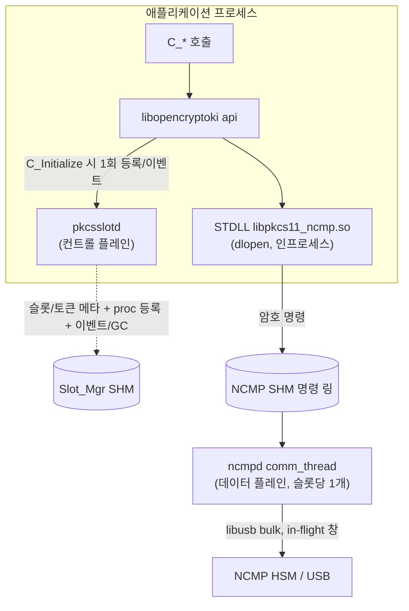

# ncmpd vs pkcsslotd — USB 명령 pipeline은 누가 하는가

이 문서는 "USB로 연결된 NCMP HSM의 명령을 **pkcsslotd**(이하 slotd)를 이용해
pipeline(병렬 in-flight)으로 처리할 수 있는가?"라는 질문에 대한 근거 기반 분석이다.
결론과 그 근거(파일:라인), 그리고 올바른 구성 방법을 정리한다.

문서 정보

| 항목 | 내용 |
|---|---|
| 대상 | opencryptoki 3.27.0 사설 포크(Token NCMP) |
| 관련 | [`architecture.md`](architecture.md), [`stdll-call-flow.md`](stdll-call-flow.md), [`../CLAUDE.md`](../CLAUDE.md) |
| 한줄 결론 | slotd로는 불가. slotd는 명령 데이터 경로에 없는 슬롯 관리·프로세스 조정용 컨트롤 플레인이며, USB·wire 프로토콜 코드가 없다. 명령 pipeline은 설계상 ncmpd의 comm_thread가 담당한다. |

---

## 1. 결론

`pkcsslotd`는 **슬롯/토큰 메타데이터 관리 + 프로세스 등록/이벤트 전달 + 가비지
수집**을 담당하는 *컨트롤 플레인* 데몬이다. 암호 명령(`C_Encrypt` 등)은 slotd를
**전혀 거치지 않는다**. 따라서 USB로 연결된 NCMP HSM 명령의 pipeline(다중 in-flight
병렬) 처리를 slotd로 수행할 수 없다. 이는 성능 한계가 아니라 **slotd가 명령
데이터 경로(data plane)에 존재하지 않는다는 아키텍처상의 이유** 때문이다.

명령 pipeline은 NCMP 전용 데몬 `ncmpd`의 슬롯별 `comm_thread`가 담당하며, 이것이
현재 구현이자 올바른 구조이다. slotd와 ncmpd는 서로 대체 관계가 아니라 **공존**한다.

---

## 2. 두 개의 평면(plane)

그림 2-1. 컨트롤 플레인(slotd)과 데이터 플레인(ncmpd)의 분리



- **컨트롤 플레인 = slotd**: 어떤 슬롯·토큰이 있고, 누가 라이브러리를 열었는지,
  이벤트/정리를 조정한다. 명령 payload를 보지 않는다.
- **데이터 플레인 = STDLL(인프로세스) → ncmpd**: 실제 암호 명령이 흐르는 경로.
  단일 USB 링크의 소유·다중화·pipeline이 여기서 일어난다.

---

## 3. 암호 명령은 slotd를 지나지 않는다 (근거)

opencryptoki의 명령 경로:

```
앱 → libopencryptoki(api) → STDLL(.so, 앱 프로세스에 dlopen) → 백엔드
```

- `C_Encrypt`(`usr/lib/api/api_interface.c:1524`)는 곧바로
  `fcn->ST_Encrypt(sltp->TokData, …)`(`usr/lib/api/api_interface.c:1560`)를
  호출한다. **STDLL 함수 포인터 직접 호출**이며 소켓도, slotd도 개입하지 않는다.
- STDLL은 각 애플리케이션 프로세스에 `dlopen`으로 적재된다
  (`usr/lib/api/apiutil.c:632`). 즉 암호 연산은 **앱 프로세스 내부**에서 실행된다.
- NCMP의 경우 그 이후 경로는
  `ncmp_specific → ncmp_crypto → ncmp_client → SHM 명령 링 → ncmpd comm_thread → USB`
  이다. **pipeline이 일어나는 지점은 ncmpd의 comm_thread**이다
  (상세 흐름은 [`stdll-call-flow.md`](stdll-call-flow.md)).

---

## 4. pkcsslotd가 실제로 하는 일 (근거)

표 4-1. slotd 구성 요소

| 구성 | 역할 | 근거 |
|---|---|---|
| 슬롯 관리자 공유메모리 `Slot_Mgr_Shr_t` | `slot_info[]`(슬롯별 CK_SLOT_INFO/CK_TOKEN_INFO) + `proc_table[]`(등록 프로세스). **명령 버퍼가 아님.** | `usr/include/slotmgr.h:236-243`, `shmget/shmat` `usr/sbin/pkcsslotd/shmem.c:75,212` |
| 소켓 서버 | 앱이 `C_Initialize`에서 **1회 등록**, 이후 슬롯/토큰 **이벤트 전달**(`proc_deliver_event`). 명령이 아니라 등록·이벤트. | 등록 `usr/lib/api/api_interface.c:3283,3346`; 서버 `usr/sbin/pkcsslotd/socket_server.c` |
| 가비지 수집 스레드 | 죽은 프로세스의 등록·락 상태 청소. | `usr/sbin/pkcsslotd/garbage_linux.c`(`GCMain`) |
| 토큰/USB/암호 코드 | **없음.** libusb·dlopen·wire·ST_Encrypt 등 전무(설정 파일의 토큰 이름 중복 검사만 존재). | grep 결과 0건(`usr/sbin/pkcsslotd/*.c`) |

요약: slotd = "어떤 슬롯·토큰이 있고, 누가 붙어 있고, 이벤트/정리를 한다" →
**부팅·조정용 컨트롤 플레인**이다. 어떤 토큰의 **명령도 처리하지 않는다**
(ICA/EP11/CCA도 각 STDLL이 자기 백엔드와 직접 통신한다).

---

## 5. pipeline(병렬 in-flight)이 요구하는 것 = 왜 comm_thread인가

- **단일 USB 링크의 배타성**: libusb 인터페이스는 한 번에 한 프로세스만 claim할 수
  있다. N개 앱이 각자 USB를 열 수 없으므로 **링크를 소유하는 단일 주체**가 반드시
  필요하다.
- **pipeline = 여러 명령을 동시에 토큰에 in-flight**(상한 `max_inflight` = 장치 SRAM
  컨테이너 수). 이를 위해선 링크를 소유하고 in-flight 창을 추적하는 **단일
  소비자**(MPSC 링의 sole consumer)가 필요하다. 정확히 comm_thread가 이 일을 한다:
  `while (comm_inflight(slot) < slot->max_inflight …) comm_dispatch(...)`로 장치
  컨테이너를 채운다(`ncmp/daemon/comm_thread.c:361`; in-flight 카운터 `:297,317`).
  USB 소유·개방은 `ncmp_transport_open`(`ncmp/daemon/main.c`).
- slotd에는 **링크도, in-flight 개념도, wire 프로토콜도 없다.**

---

## 6. 왜 slotd로는 안 되나 / 목적이 다른가

1. **목적 불일치**: slotd는 *모든 토큰 공용*의 슬롯 관리·프로세스 조정용이다. NCMP의
   USB 다중화·pipeline은 *NCMP 전용 데이터 플레인*이다. 두 기능은 계층이 다르다.
2. **slotd는 명령을 본 적이 없다**: 상위 opencryptoki 모델에서 어떤 토큰의 명령도
   slotd를 지나지 않는다. NCMP만 "여러 프로세스가 단일 USB를 공유"하는 특수 제약이
   있어 별도 데몬(ncmpd)이 필요했다. `../CLAUDE.md`도 "ncmpd는 pkcsslotd의
   대체/후킹이 아니라 별도 파이프/프록시 데몬"이라고 명시한다.
3. **넣으려면 결국 ncmpd를 slotd에 복제**: slotd를 데이터 경로에 넣으려면 USB 소유 +
   SHM 명령 링 소비 + 슬롯별 worker(in-flight 관리)를 slotd에 이식해야 하는데, 이는
   ncmpd 로직을 업스트림 공용 데몬에 복제하는 것이다. 공용 컴포넌트를 NCMP 전용 USB
   로직으로 오염시키고 업스트림과 포크되며, 얻는 이득이 없다.
4. **동시성 모델 불일치**: slotd 소켓 서버는 등록·이벤트용 accept 루프(컨트롤 플레인)
   이지, 고throughput 슬롯별 pipeline 소비자가 아니다. pipeline은 in-flight 창 +
   CAS 링 + 단일 소비자 모델을 요구하며 이것이 곧 comm_thread다.

---

## 7. 가능하다면 어떻게 — 올바른 방법

- 굳이 한다면 slotd를 고치는 게 아니라 **지금처럼 별도 데몬(ncmpd)로 두는 것이
  정답**이다. 이미 올바른 구조이며, slotd와 ncmpd는 공존한다(라이브러리 초기화는
  slotd에 등록, 명령 데이터는 ncmpd로).
- pipeline을 더 키우려면 slotd가 아니라 **ncmpd/comm_thread 쪽을 튜닝**한다
  (근거: `ncmp/include/ncmp/ncmp_limits.h`, `ncmp/daemon/comm_thread.c`):
  - `NCMP_DEV_CONTAINER_COUNT`(= `NCMP_DEFAULT_MAX_INFLIGHT`) 상향 → 동시 in-flight
    창 확대(펌웨어의 실제 컨테이너 수와 일치해야 함).
  - `NCMP_QUEUE_DEPTH`(슬롯 링 깊이) 조정 → 더 많은 대기 명령 수용.
  - 물리 슬롯이 여럿이면 슬롯당 comm_thread(이미 슬롯당 1개)로 수평 확장.
  - 하드웨어가 지원하면 USB 다중 bulk 엔드포인트/스트림으로 실제 병렬 전송 확대.

---

## 8. 오해 교정

"slotd가 명령을 pipeline한다"는 전제 자체가 상위 opencryptoki 모델과 다르다 — slotd는
**암호 명령을 본 적이 없다**. NCMP에서 명령 pipeline은 설계상 ncmpd의 comm_thread가
담당하는 것이 맞고, 그것이 현재 구현이다.

---

## 부록 A. 근거 파일:라인 색인

| 사실 | 위치 |
|---|---|
| C_Encrypt가 STDLL 함수포인터 직접 호출 | `usr/lib/api/api_interface.c:1524, 1560` |
| STDLL이 앱 프로세스에 dlopen | `usr/lib/api/apiutil.c:632` |
| slotd 등록은 C_Initialize 1회 | `usr/lib/api/api_interface.c:3283, 3346` |
| slotd 공유메모리 = slot_info[] + proc_table[] | `usr/include/slotmgr.h:236-243` |
| slotd 공유메모리 attach | `usr/sbin/pkcsslotd/shmem.c:75, 212` |
| slotd 소켓 서버(등록/이벤트) | `usr/sbin/pkcsslotd/socket_server.c` |
| slotd 가비지 수집 스레드 | `usr/sbin/pkcsslotd/garbage_linux.c`(`GCMain`) |
| ncmpd comm_thread pipeline(in-flight) | `ncmp/daemon/comm_thread.c:361, 297, 317` |
| ncmpd USB 소유/개방 | `ncmp/daemon/main.c`(`ncmp_transport_open`) |
| in-flight/컨테이너 상수 | `ncmp/include/ncmp/ncmp_limits.h` |
